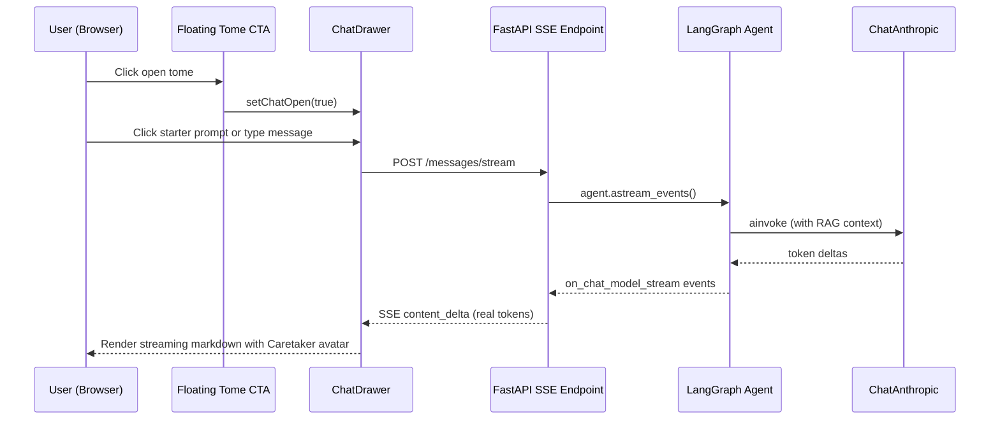

# Archivist Chat Enhancement

## 1. Requirements Summary

Source: user request (this conversation) and [PROMPT.md](.docs/PROMPT.md).

- Integrate with a **real LLM** (Anthropic Claude) so The Caretaker produces genuine answers from RAG context
- Create a **themed assistant avatar** reflecting an old antiquarian scholar / grimoire motif for "The Caretaker"
- Create a **themed user avatar** reflecting the user's inquisitive nature (explorer/seeker)
- Make the **chat entry point** more prominent and first-class -- floating CTA, always visible, eye-catching
- **Rebrand** the app from "Exile's Archive" to **"The Archive"**; rename the assistant persona from "The Archivist" to **"The Caretaker"**
- Add **clickable starter prompts** to the chat empty state for discoverability
- All changes must preserve the existing mock/Ollama providers as fallbacks
- The app must remain locally runnable; Anthropic key is optional (mock still works without one)
- Streaming should feel responsive -- real token streaming when the LLM supports it

## 2. Ambiguities and Assumptions


| Area                 | Ambiguity                                        | Assumption                                                                                                                   |
| -------------------- | ------------------------------------------------ | ---------------------------------------------------------------------------------------------------------------------------- |
| LLM model            | Which Claude model to default to                 | Default to `claude-sonnet-4-20250514` (good balance of quality/cost/speed); configurable via `ANTHROPIC_MODEL` env var       |
| API key management   | How the key is provided                          | Via `ANTHROPIC_API_KEY` env var; no `.env` file committed. When empty, the app falls back to mock provider                   |
| Avatar style         | Exact visual design for avatars                  | Caretaker: open tome/grimoire SVG in gold/crimson. User: compass rose SVG in blue. Both inline SVG, no external assets       |
| Chat CTA placement   | Exact position and behavior                      | Fixed bottom-right FAB (56px circle), pulsing gold glow, toggles to X when drawer is open. Replaces header button entirely   |
| Real streaming scope | Whether to stream from LangGraph or just the LLM | Stream token deltas from `agent.astream_events()` filtered to LLM output events; simulated chunking remains for mock         |
| System prompt        | How much personality to inject                   | Moderate -- scholarly, slightly formal, warm. Not overly theatrical. Stays grounded in document context                      |
| Branding scope       | How far the rename extends                       | Header title, chat drawer header, empty states, page titles, FAB tooltip. Internal code names (variable names, DB) unchanged |
| Starter prompts      | How many and what content                        | 3-4 hardcoded prompts themed to The Caretaker persona; clickable chips that populate the input and send                      |


## 3. High-Level Architecture

### Chat flow with Anthropic integration




### Key modules

- `backend/app/agent/llm.py` -- LLM factory; mock, Ollama, or Anthropic
- `backend/app/agent/graph.py` -- LangGraph RAG pipeline; system prompt lives here
- `backend/app/config.py` -- All settings including new Anthropic config
- `backend/app/api/conversations.py` -- SSE streaming endpoint; simulated or real
- `frontend/src/components/chat/ChatDrawer.tsx` -- Main chat drawer UI
- `frontend/src/components/chat/avatars.tsx` -- New: Caretaker + User avatar SVGs
- `frontend/src/components/layout/Layout.tsx` -- Layout; will host the floating FAB
- `frontend/src/components/layout/Header.tsx` -- Header; chat button removed
- `frontend/src/index.css` -- Theme variables, glow animation keyframes

### Data model

No schema changes. Existing tables (`conversations`, `messages`, `documents`, `chunks`) are unaffected. The only data-layer change is that `messages.content` will now contain real LLM output instead of mock-formatted text.

## 4. ADRs to Write

1. **ADR-0010: Anthropic LLM integration** -- Why Anthropic was added as a provider, model selection rationale, streaming approach, and fallback strategy. Written before Milestone 1.

## 5. Milestones

### Milestone 1: Anthropic LLM integration

**Goal**: The app can generate real LLM answers via Claude when `LLM_PROVIDER=anthropic` is set, with an in-character Caretaker system prompt.

**Implementation details**:

- Add `langchain-anthropic>=0.3` to [backend/pyproject.toml](backend/pyproject.toml)
- Add `anthropic_api_key` and `anthropic_model` fields to `Settings` in [backend/app/config.py](backend/app/config.py)
- Add `elif settings.llm_provider == "anthropic"` branch in `create_llm()` in [backend/app/agent/llm.py](backend/app/agent/llm.py), returning `ChatAnthropic(model=..., api_key=..., streaming=True)`
- Rewrite `_SYSTEM_PROMPT` in [backend/app/agent/graph.py](backend/app/agent/graph.py) to embody The Caretaker persona (scholarly, precise, warm -- a devoted keeper of The Archive)
- Enable `query_rewrite=True` for the anthropic provider in [backend/app/main.py](backend/app/main.py) (same gating as ollama)
- Validate that `anthropic_api_key` is non-empty when provider is `anthropic`; raise clear startup error otherwise
- Write ADR `0010-anthropic-llm-integration.md`

**Tests**:

- `test_create_llm_returns_mock_by_default` -- existing, verify still passes
- `test_create_llm_returns_anthropic_when_configured` -- new; assert returned type is `ChatAnthropic`
- `test_create_llm_raises_on_missing_api_key` -- new; provider=anthropic with empty key raises `ValueError`
- `test_system_prompt_contains_caretaker_persona` -- new; assert key phrases in `_SYSTEM_PROMPT`
- Manual: send a message with `LLM_PROVIDER=anthropic` and verify a coherent, in-character response

**Commits**: 2-3

1. `feat(agent): add Anthropic Claude as LLM provider`
2. `feat(agent): rewrite system prompt for The Caretaker persona`
3. `docs(adr): add ADR-0010 for Anthropic LLM integration`

---

### Milestone 2: Real token streaming

**Goal**: When using a streaming-capable LLM (Anthropic, Ollama), SSE responses deliver real token-by-token deltas instead of simulated word chunks.

**Implementation details**:

- Refactor `_stream_response()` in [backend/app/api/conversations.py](backend/app/api/conversations.py) to use `agent.astream_events(version="v2")` for real streaming
- Filter events for `on_chat_model_stream` kind and extract token content from `AIMessageChunk`
- Persist the user message before streaming begins; persist the full assistant message after streaming completes
- Keep simulated chunking as fallback when `LLM_PROVIDER=mock` (mock does not yield stream events)
- Emit the same SSE event shape (`message_start`, `content_delta`, `sources`, `message_end`) so the frontend needs no changes
- Handle conversation history loading and source extraction outside the streaming loop

**Tests**:

- `test_stream_endpoint_yields_sse_events` -- existing, verify still passes with mock
- `test_stream_response_emits_real_deltas_with_anthropic` -- new; integration test using a mock that yields `AIMessageChunk` events
- `test_stream_response_falls_back_to_simulated_for_mock` -- new; verify mock provider still uses chunked simulation
- `test_stream_persists_messages_after_completion` -- new; verify both user and assistant messages are in DB after stream ends
- Manual: observe real token-by-token rendering in the chat drawer with `LLM_PROVIDER=anthropic`

**Commits**: 1-2

1. `feat(api): implement real token streaming via astream_events`
2. `refactor(api): preserve simulated streaming fallback for mock provider`

---

### Milestone 3: Caretaker and User avatars + starter prompts

**Goal**: The chat UI shows a themed tome avatar for The Caretaker and a compass-rose avatar for the user, replacing the plain "A" circles, and the empty conversation state offers clickable starter prompts for discoverability.

**Implementation details**:

- Create [frontend/src/components/chat/avatars.tsx](frontend/src/components/chat/avatars.tsx) with two components:
  - `CaretakerAvatar({ size: "sm" | "md" | "lg" })` -- open tome/grimoire SVG, gold/crimson gradient fill, sizes map to 32/48/64px
  - `UserAvatar({ size: "sm" | "md" | "lg" })` -- compass rose SVG, blue accent fill, same size scale
- Replace the "A" gradient circle in [ChatDrawer.tsx](frontend/src/components/chat/ChatDrawer.tsx):
  - Header (line 96-98): `<CaretakerAvatar size="sm" />`
  - `DrawerEmptyState` (line 373): `<CaretakerAvatar size="lg" />`
- Replace the "A" circle in [ChatPage.tsx](frontend/src/pages/ChatPage.tsx) (line 13-15): `<CaretakerAvatar size="lg" />`
- Update `MessageBubble` in [ChatDrawer.tsx](frontend/src/components/chat/ChatDrawer.tsx) to show:
  - `<CaretakerAvatar size="sm" />` to the left of assistant messages
  - `<UserAvatar size="sm" />` to the right of user messages
- Adjust message bubble layout from single `<div>` to flex row with avatar + bubble
- Rename "The Archivist" to **"The Caretaker"** in the drawer header and empty state text
- Add 3-4 clickable starter prompt chips to `DrawerEmptyState` (when `hasDocuments` is true):
  - e.g. "What themes connect these documents?", "Summarize the key findings", "What are the most important details?", "Find contradictions across sources"
  - Clicking a chip calls `onCreate()` then sends the prompt text as the first message
  - Styled as gold-bordered pill buttons matching the existing `poe-btn-secondary` aesthetic

**Tests**:

- Visual verification: avatars render at all three sizes without clipping or misalignment
- Verify avatars appear next to every message bubble (user and assistant)
- Verify the drawer header and empty states use the new avatar and say "The Caretaker"
- Verify starter prompts render when documents exist but not when empty
- Verify clicking a starter prompt creates a conversation and sends the message
- No existing tests should break (avatars and prompts are presentational + wiring)

**Commits**: 3

1. `feat(ui): add CaretakerAvatar and UserAvatar SVG components`
2. `feat(ui): integrate avatars into chat drawer, message bubbles, and empty states`
3. `feat(ui): add clickable starter prompts to chat empty state`

---

### Milestone 4: Floating chat CTA + app rebrand

**Goal**: A floating open-tome button in the bottom-right corner serves as the primary, always-visible entry point to chat, replacing the easy-to-miss header button. The app is rebranded from "Exile's Archive" to "The Archive".

**Implementation details**:

- Remove the chat toggle `<button>` from [Header.tsx](frontend/src/components/layout/Header.tsx) nav (lines 82-89); remove the `onToggleChat` prop and `ChatIcon` component
- Rename "Exile's Archive" to **"The Archive"** in [Header.tsx](frontend/src/components/layout/Header.tsx) (line 44) and any other references (page titles, footer, etc.)
- Add a `FloatingChatButton` component in [Layout.tsx](frontend/src/components/layout/Layout.tsx) or a new file:
  - `fixed bottom-6 right-6` positioning (`bottom-4 right-4` on mobile)
  - 56px circular button with `poe-btn-primary` gold gradient + `rounded-full`
  - Custom open-tome SVG icon (simpler/bolder than the avatar version -- CTA needs to read at small size)
  - When drawer is open: morphs to an X close icon with smooth transition
  - `z-40` (below the drawer's `z-50`)
  - `title="Ask The Caretaker"` tooltip on hover
- Add glow-pulse animation to [index.css](frontend/src/index.css):
  ```css
  @keyframes glow-pulse {
    0%, 100% { box-shadow: 0 0 8px rgba(200, 170, 110, 0.3); }
    50% { box-shadow: 0 0 20px rgba(200, 170, 110, 0.6); }
  }
  ```
- Apply the animation to the FAB when drawer is closed; stop when open (so the X icon is calm)
- Update `Header` props: remove `onToggleChat`; update `Layout` to wire `toggleChat` to the FAB instead

**Tests**:

- Visual: FAB is visible on all pages, at all viewport sizes
- Visual: FAB toggles between tome icon and X icon based on drawer state
- Visual: glow pulse animation is visible and stops when drawer opens
- Keyboard: FAB is focusable and activatable via Enter/Space
- Verify "The Archive" branding appears in header, page titles
- No existing tests should break

**Commits**: 3

1. `feat(ui): add floating open-tome chat button with glow animation`
2. `refactor(ui): remove chat toggle from header, wire FAB as primary CTA`
3. `feat(ui): rebrand app from Exile's Archive to The Archive`

## 6. Dependency Summary

**Backend**:

- `langchain-anthropic>=0.3` -- LangChain adapter for Anthropic Claude models; provides `ChatAnthropic` with native streaming support

**Frontend**:

- No new dependencies -- avatars are inline SVG components; animations use CSS keyframes; layout uses existing Tailwind utilities

