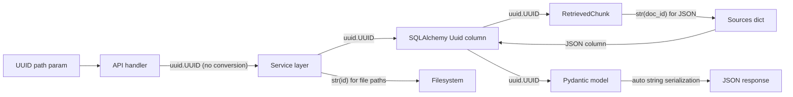

# Backend Idiom Fixes

## 1. Requirements Summary

From the idiom analysis performed against the backend and [PROMPT.md](../../.docs/PROMPT.md):

- Code should demonstrate idiomatic use of the chosen frameworks (SQLAlchemy 2.0, FastAPI, Pydantic v2, LangGraph)
- Correctness > readability > extensibility > performance
- Do not over-engineer; build what is asked for, well
- All tests must pass after changes
- Each commit leaves the project in a buildable, runnable state

Four findings were identified. The largest is migrating string primary keys to PostgreSQL's native UUID type. The other three are trivial type safety and import hygiene fixes.

## 2. Ambiguities and Assumptions

| Area                        | Ambiguity                                                            | Assumption                                                                                                               |
| --------------------------- | -------------------------------------------------------------------- | ------------------------------------------------------------------------------------------------------------------------ |
| Data migration              | Should existing data be preserved during UUID migration?             | No. User confirmed a fresh volume. Migration can use `USING id::uuid` cast.                                              |
| RetrievedChunk type         | Should the retrieval DTO use `uuid.UUID` or `str` for `document_id`? | `uuid.UUID` to match the DB column. Convert to `str` only at JSON serialization boundaries (sources dict in `graph.py`). |
| Migration strategy          | Rewrite existing migrations or add a new additive migration?         | Additive: new migration `0007`. Standard practice even on a fresh DB.                                                    |
| Pydantic UUID serialization | How should UUID fields appear in JSON responses?                     | Pydantic v2 serializes `uuid.UUID` as a string by default. No custom serializer needed. API contract is unchanged.       |

## 3. High-Level Architecture

No structural changes. This is a type-level refactor within existing modules.

**Key modules modified:**

- `backend/app/db/models.py` -- PK and FK column types
- `backend/alembic/versions/0007_*.py` -- New migration
- `backend/app/services/document_service.py` -- ID generation, function signatures, file path construction
- `backend/app/services/conversation_service.py` -- ID generation, function signatures
- `backend/app/services/processing.py` -- `DocumentProcessor` protocol and `PipelineProcessor.process` signature
- `backend/app/services/retrieval.py` -- `RetrievedChunk.document_id` type
- `backend/app/agent/graph.py` -- Sources serialization, type annotations, imports
- `backend/app/api/conversations.py` -- Remove `str()` path param conversions
- `backend/app/api/documents.py` -- Remove `str()` path param conversions
- `backend/app/models/conversation.py` -- UUID fields in Pydantic models, `ConfigDict`
- `backend/app/models/document.py` -- UUID fields in Pydantic model, `ConfigDict`

**Type flow after migration:**

## 4. ADRs to Write

None. This is a type-correctness fix within existing architecture, not a structural decision.

## 5. Milestones

### Milestone 1: Native UUID primary keys

**Goal**: All primary keys and foreign keys use PostgreSQL's native `uuid` type, eliminating `str(uuid.uuid4())` boilerplate and `str()` conversions at the API layer.

**Implementation details**:

- **DB models** ([backend/app/db/models.py](backend/app/db/models.py)): Change `id` columns on all 4 models from `Mapped[str] = mapped_column(String, primary_key=True)` to `Mapped[uuid.UUID] = mapped_column(Uuid, primary_key=True, default=uuid.uuid4)`. Change FK columns (`Chunk.document_id`, `Message.conversation_id`) from `String` to `Uuid`. Import `Uuid` from `sqlalchemy` and `uuid` from stdlib.
- **Alembic migration** (new `0007_convert_ids_to_native_uuid.py`): For each of the 4 tables, alter PK columns from `VARCHAR` to `UUID USING id::uuid`. For FK columns, drop FK constraint, alter type, re-add FK constraint. Follow the pattern in existing migrations (e.g., `0006`).
- **document_service.py** ([backend/app/services/document_service.py](backend/app/services/document_service.py)): Change `doc_id = str(uuid.uuid4())` to `doc_id = uuid.uuid4()`. Update `get_document` and `delete_document` signatures from `document_id: str` to `document_id: uuid.UUID`. Use `str(doc_id)` for file path construction only (`settings.upload_dir / str(doc_id)`).
- **conversation_service.py** ([backend/app/services/conversation_service.py](backend/app/services/conversation_service.py)): Change `id=str(uuid.uuid4())` to `id=uuid.uuid4()` in `create_conversation` and `add_message`. Update all `conversation_id: str` parameters to `conversation_id: uuid.UUID` across `get_conversation`, `get_conversation_with_messages`, `delete_conversation`, `add_message`, `set_conversation_title`, `get_conversation_history`, `run_agent_turn`.
- **processing.py** ([backend/app/services/processing.py](backend/app/services/processing.py)): Change `DocumentProcessor.process` protocol and `PipelineProcessor.process` signature from `doc_id: str` to `doc_id: uuid.UUID`. Change `id=str(uuid.uuid4())` to `id=uuid.uuid4()` for chunk creation.
- **Pydantic models** ([backend/app/models/conversation.py](backend/app/models/conversation.py), [backend/app/models/document.py](backend/app/models/document.py)): Change `id: str` to `id: uuid.UUID`, `conversation_id: str` to `conversation_id: uuid.UUID` in `MessageResponse`, `document_id: str` to `document_id: uuid.UUID` in `SourceAttribution`. Import `uuid` from stdlib.
- **RetrievedChunk** ([backend/app/services/retrieval.py](backend/app/services/retrieval.py)): Change `document_id: str` to `document_id: uuid.UUID`. The `rrf_merge` key type becomes `tuple[uuid.UUID, int]` (UUID is hashable, no behavior change).
- **Agent graph** ([backend/app/agent/graph.py](backend/app/agent/graph.py)): In `_build_generate_node`, convert `chunk.document_id` to `str()` when building the sources dict (JSON doesn't support UUID natively, and this dict is stored in a JSON column).
- **API handlers** ([backend/app/api/conversations.py](backend/app/api/conversations.py), [backend/app/api/documents.py](backend/app/api/documents.py)): Remove all `str(conversation_id)` and `str(document_id)` conversions -- pass UUID path params directly to service functions.
- **Tests** ([backend/tests/test_conversations.py](backend/tests/test_conversations.py)): Update `test_conversation_history_truncated` to pass `UUID(conv["id"])` to `add_message` and `get_conversation_history`. Other tests use HTTP responses (string IDs in JSON) and should work without changes.

**Tests**:

- All existing tests pass with UUID columns
- `POST /api/conversations/not-a-uuid/messages` still returns 422
- `DELETE /api/documents/not-a-uuid` still returns 422
- Document upload/delete cycle works end-to-end (file paths use `str(uuid)`)
- Chat with documents works (sources contain valid UUID document_ids as strings in JSON)

**Commits**: ~2 (DB models + migration, then service/handler/Pydantic/test updates)

---

### Milestone 2: Type safety, import hygiene, and test coverage gaps

**Goal**: Remaining trivial idiom gaps are closed and two untested code paths gain coverage -- proper type annotations, top-level imports, idiomatic Pydantic config, pagination total assertions, and delete-with-missing-files test.

**Implementation details**:

- **Type `session_factory**` ([backend/app/agent/graph.py](backend/app/agent/graph.py)): Change `session_factory: Any` to `async_sessionmaker[AsyncSession]` in `_build_retrieve_node` (line 77) and `build_agent_graph` (line 199). Add `async_sessionmaker` and `AsyncSession` to the `TYPE_CHECKING` imports.
- **Move `deduplicate_chunks` import** ([backend/app/agent/graph.py](backend/app/agent/graph.py)): Move from the conditional block inside the closure (line 94) to a top-level import alongside the existing `RetrievedChunk` and `RetrievalService` imports from `app.services.retrieval`.
- `**ConfigDict**` ([backend/app/models/conversation.py](backend/app/models/conversation.py), [backend/app/models/document.py](backend/app/models/document.py)): Replace `model_config = {"from_attributes": True}` with `model_config = ConfigDict(from_attributes=True)`. Import `ConfigDict` from `pydantic`.
- **Pagination `total` assertions** ([backend/tests/test_documents.py](backend/tests/test_documents.py), [backend/tests/test_conversations.py](backend/tests/test_conversations.py)): In `test_list_documents_pagination`, add `assert resp.json()["total"] == 3` to both paginated responses. Same pattern in `test_list_conversations_pagination`.
- **Delete with missing files test** ([backend/tests/test_documents.py](backend/tests/test_documents.py)): New test `test_delete_document_files_already_removed` -- upload a document, remove the file directory via `shutil.rmtree` before calling `DELETE /api/documents/{id}`, and assert 204 (not 500). Exercises the `OSError` guard in `document_service.delete_document`.

**Tests**:

- All existing tests still pass (no behavior change from type/import fixes)
- Pagination tests verify `total == 3` when `limit=2` on both pages
- Delete returns 204 when file directory is already missing

**Commits**: ~2 (type safety and import hygiene, then test coverage additions)

## 6. Dependency Summary

No new dependencies. All changes use existing libraries:

**Backend**:

- `sqlalchemy` -- `Uuid` type (available since SQLAlchemy 2.0, already a dependency)
- `pydantic` -- `ConfigDict` (available since Pydantic 2.0, already a dependency)
- `uuid` -- stdlib, already imported throughout

