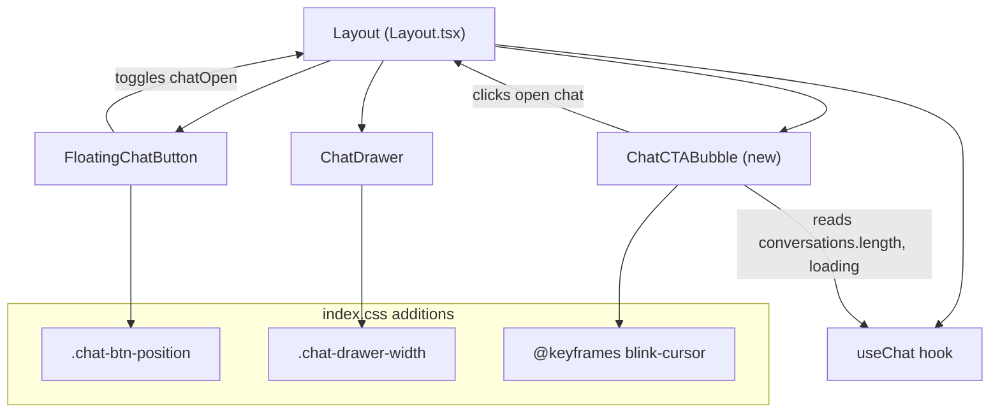

# Chat UX Enhancements

## 1. Requirements Summary

- Bigger floating chat button with a more recognizable icon
- Reposition button left to align horizontally with the "Related Documents" column on xl+ screens
- Wider chat drawer -- extend to the right edge of article content on xl+, wider than 420px on sm+
- Better paragraph spacing in assistant chat responses
- Headings in chat responses should be visually distinct (color too similar to body text currently)
- Clippy-style CTA speech bubble anchored to the floating button:
  - Only for users with no conversation history
  - First appears after ~45s, then every 5 minutes
  - Text streams in with typewriter effect
  - Rotates through different messages
  - Clicking opens the chat

## 2. Ambiguities and Assumptions

| Area               | Ambiguity                                                                         | Assumption                                                                                                                                              |
| ------------------ | --------------------------------------------------------------------------------- | ------------------------------------------------------------------------------------------------------------------------------------------------------- |
| Button alignment   | "Related Documents" column only renders on xl+ and only on DocumentPage           | On xl+ use `calc()` to center button under where the column sits; below xl keep `right-6`                                                               |
| Drawer width on xl | "All the way to right side of article content" -- exact edge or approximate?      | Drawer covers Related Documents column + gap, aligned to article right edge using layout math against `max-w-7xl`                                       |
| CTA dismissal      | Should clicking elsewhere dismiss the bubble, or only clicking the bubble/button? | Bubble auto-fades after typewriter completes + 4s; clicking bubble opens chat; opening chat hides bubble; no explicit dismiss-on-click-elsewhere needed |
| CTA persistence    | Should "never chatted" survive page refreshes?                                    | Use `conversations.length === 0` from the API -- naturally persists since it's server state                                                             |

## 3. High-Level Architecture

**Key modules:**

- `[frontend/src/components/layout/Layout.tsx](frontend/src/components/layout/Layout.tsx)` -- `FloatingChatButton` (size, icon, position), new `ChatCTABubble` component
- `[frontend/src/components/chat/ChatDrawer.tsx](frontend/src/components/chat/ChatDrawer.tsx)` -- drawer width class, prose override classes on `MessageBubble` and streaming block
- `[frontend/src/index.css](frontend/src/index.css)` -- `.chat-btn-position`, `.chat-drawer-width`, bubble animation keyframes
- `[frontend/src/hooks/useChat.ts](frontend/src/hooks/useChat.ts)` -- provides `conversations`, `loading` (read-only, no changes needed)

**Layout geometry (xl+ screens):**

- `max-w-7xl` = 80rem centered, `px-6` = 1.5rem padding
- Related column: `w-56` (14rem), rightmost in flex row, gap-6 (1.5rem) from article
- Button center from right viewport edge: `calc((100vw - 80rem) / 2 + 1.5rem + 7rem)`
- Drawer width from right edge: `calc((100vw - 80rem) / 2 + 1.5rem + 14rem + 1.5rem)`

## 4. ADRs to Write

None. These are cosmetic UI changes within existing components. No structural decisions or new module boundaries.

## 5. Milestones

### Milestone 1: Button polish

**Goal:** The floating chat button is larger, has a more detailed tome icon, and sits horizontally aligned under the Related Documents column on xl+ screens.

**Implementation details:**

- In `FloatingChatButton`: change `w-14 h-14` to `w-16 h-16`, scale icon SVG to `w-7 h-7`
- Replace `TomeIcon` with a more detailed tome SVG adapted from the `CaretakerAvatar` inner paths (page lines, colored spine) without the outer circle
- Add `.chat-btn-position` class in `index.css` with `right: 1.5rem` default and `@media (min-width: 1280px)` override using `right: calc((100vw - 80rem) / 2 + 1.5rem + 7rem)`
- Apply `.chat-btn-position` to the button, replacing the current `right-4 sm:right-6`

**Tests:**

- Visual verification: button renders at 64px, icon is legible
- On xl+ viewport, button sits under the Related Documents column
- On smaller viewports, button stays at right edge

**Commits:** 1 -- `feat(chat): enlarge button, improve icon, reposition on xl`

---

### Milestone 2: Drawer width + message styling

**Goal:** The chat drawer is wider and covers the Related Documents column on xl+, and assistant messages have clearly spaced paragraphs with gold-accented headings.

**Implementation details:**

- Add `.chat-drawer-width` class in `index.css`: `width: 100%` mobile, `width: 540px` at sm, `width: calc((100vw - 80rem) / 2 + 1.5rem + 14rem + 1.5rem)` at xl (with a `min-width: 540px` floor)
- Apply `.chat-drawer-width` to the drawer root `div`, replacing `w-full sm:w-[420px]`
- On the prose wrapper in both `MessageBubble` (line 266) and streaming block (line 233), add Tailwind arbitrary variants for paragraph spacing: `[&_p]:mb-3 [&_p]:leading-relaxed [&_ul]:mb-3 [&_ol]:mb-3`
- On the same wrapper, add heading overrides: `[&_h1]:text-[var(--color-accent-gold)] [&_h1]:font-heading [&_h1]:text-base [&_h1]:font-semibold [&_h1]:mt-4 [&_h1]:mb-2 [&_h2]:text-[var(--color-accent-gold)] [&_h2]:font-heading [&_h2]:text-sm [&_h2]:font-semibold [&_h2]:mt-3 [&_h2]:mb-1.5 [&_h3]:text-[var(--color-accent-gold-dim)] [&_h3]:font-heading [&_h3]:text-sm [&_h3]:font-medium [&_h3]:mt-2 [&_h3]:mb-1`

**Tests:**

- Visual verification: drawer width on sm (~540px) and xl (extends to article edge)
- Paragraphs in assistant responses have visible spacing between them
- Headings in assistant responses render in gold with the Cinzel font, clearly distinct from body text

**Commits:** 1 -- `feat(chat): widen drawer and improve response typography`

---

### Milestone 3: Clippy CTA bubble

**Goal:** A speech bubble with streaming text appears near the floating button to nudge first-time users toward chat, showing only when there is no conversation history.

**Implementation details:**

- New `ChatCTABubble` component in `Layout.tsx` accepting `chatOpen`, `hasConversations`, `conversationsLoading`, `onOpen`
- Renders only when `!hasConversations && !conversationsLoading && !chatOpen`
- Timer logic: `setTimeout` at 45s for first show, then `setInterval` at 5min for repeats; all cleared on unmount or when conditions change
- Rotating messages array (4 entries), `messageIndex` state cycling on each appearance
- Typewriter effect: `setInterval` at ~35ms building `typedText` state char by char; blinking cursor span appended during typing
- After typing completes, bubble stays 4s then fades out via `opacity-0 transition-opacity duration-500`
- Positioned to the left of the button: `fixed bottom-4` (matching button), `right` offset = button width + gap, using the same `.chat-btn-position` right anchor + offset
- Speech bubble tail: CSS `::after` pseudo-element triangle pointing right
- Clicking the bubble calls `onOpen()` to open the chat drawer
- Add `@keyframes blink-cursor` in `index.css` for the typing cursor animation

**Tests:**

- Bubble does not appear when `conversations.length > 0`
- Bubble does not appear when chat drawer is open
- Bubble appears after ~45s on first load with no conversations
- Text streams in character by character
- Bubble auto-dismisses after typing completes + 4s
- Clicking bubble opens chat drawer
- All timers cleaned up on unmount (no memory leaks)

**Commits:** 1 -- `feat(chat): add Clippy-style CTA bubble with typewriter effect`

## 6. Dependency Summary

**Frontend:** No new dependencies. All changes use existing React, Tailwind CSS, and CSS custom properties already in the project.