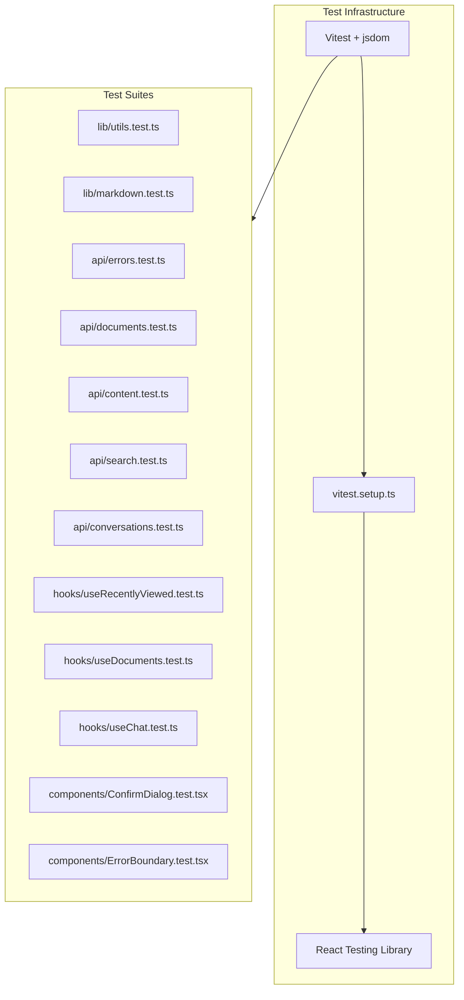

# Frontend Unit Tests

## 1. Requirements Summary

- Add a test runner and supporting libraries to the frontend project (currently has zero testing infrastructure)
- Write unit tests covering pure utility functions, API modules, hooks, and key components
- Tests should follow the project's [testing standards](.cursor/rules/testing.mdc): test behavior not internals, cover happy/edge/error paths, use descriptive names, mock at boundaries
- Test suite must pass before committing; no broken tests allowed
- Source: [PROMPT.md](.docs/PROMPT.md) lists React as the UI stack and the [assessment rules](.cursor/rules/assessment.mdc) require production-quality code with proper test coverage

## 2. Ambiguities and Assumptions

| Area                                   | Ambiguity                                                                   | Assumption                                                                                                                                           |
| -------------------------------------- | --------------------------------------------------------------------------- | ---------------------------------------------------------------------------------------------------------------------------------------------------- |
| Test runner                            | Vitest vs Jest                                                              | Vitest -- native Vite integration, zero duplicate config, faster startup. Will document in an ADR.                                                   |
| Component test depth                   | Full page-level integration vs. small component units                       | Focus on unit-level logic and small component behavior; skip full page rendering with router/context wiring for now since it's lower ROI and fragile |
| `extractHeadings` / `extractText`      | These are unexported internal functions in `DocumentPage.tsx`               | Extract them to `lib/markdown.ts` so they can be directly unit-tested as pure functions                                                              |
| SSE stream testing                     | How to simulate ReadableStream in tests                                     | Use manual ReadableStream construction with TextEncoder to feed SSE lines                                                                            |
| `useRecentlyViewed` module-level state | Module has mutable `cachedRaw`, `cachedSnapshot`, `listeners` at file scope | Reset localStorage and re-import or clear module cache between tests to avoid leakage                                                                |

## 3. High-Level Architecture

**Key modules / test file mapping:**

- `src/lib/utils.ts` -> `src/lib/__tests__/utils.test.ts` -- 6 pure functions
- `src/lib/markdown.ts` (new, extracted) -> `src/lib/__tests__/markdown.test.ts` -- `extractHeadings`, `extractText`
- `src/api/errors.ts` -> `src/api/__tests__/errors.test.ts` -- `ApiError`, `parseErrorResponse`, `throwIfNotOk`
- `src/api/documents.ts` -> `src/api/__tests__/documents.test.ts` -- `getFileExtension`, `isAllowedFileType`, fetch functions
- `src/api/content.ts` -> `src/api/__tests__/content.test.ts` -- `fetchDocumentContent`, `fetchRelatedDocuments`
- `src/api/search.ts` -> `src/api/__tests__/search.test.ts` -- `searchDocuments`
- `src/api/conversations.ts` -> `src/api/__tests__/conversations.test.ts` -- CRUD + SSE `sendMessageStream`
- `src/hooks/__tests__/useRecentlyViewed.test.ts` -- localStorage external store
- `src/hooks/__tests__/useDocuments.test.ts` -- validation, API integration
- `src/hooks/__tests__/useChat.test.ts` -- streaming, conversation management
- `src/components/__tests__/ConfirmDialog.test.tsx` -- dialog open/close, callbacks
- `src/components/__tests__/ErrorBoundary.test.tsx` -- error catching, recovery

## 4. ADRs to Write

1. **ADR: Frontend test framework choice** -- Vitest + React Testing Library over Jest, rationale and trade-offs

## 5. Milestones

### Milestone 1: Test infrastructure setup

**Goal:** `npm test` runs Vitest with jsdom and React Testing Library available; a trivial smoke test passes.

**Implementation details:**

- Install dev dependencies: `vitest`, `@testing-library/react`, `@testing-library/jest-dom`, `@testing-library/user-event`, `jsdom`
- Create `vitest.config.ts` (or extend `vite.config.ts` with a `test` block) with `environment: 'jsdom'` and `setupFiles`
- Create `src/test/setup.ts` importing `@testing-library/jest-dom/vitest`
- Add `"test": "vitest run"` and `"test:watch": "vitest"` scripts to `package.json`
- Update `tsconfig.app.json` to include vitest types
- Write one trivial test (`src/lib/__tests__/smoke.test.ts`) to verify the pipeline
- Write ADR for test framework choice

**Tests:** Verify `npm test` exits 0 with the smoke test passing.

**Commits:** 1 -- `test(frontend): add vitest and react testing library infrastructure`

---

### Milestone 2: Unit tests for pure functions

**Goal:** All pure utility functions and extracted markdown helpers have thorough test coverage.

**Implementation details:**

- `src/lib/__tests__/utils.test.ts`:
  - `filenameToTitle`: standard filenames, no extension, multiple dots, hyphens, underscores, empty string
  - `toSlug`: normal case, special characters in filename, empty title
  - `fromSlug`: slug with separator, slug without separator (returns whole string)
  - `fileTypeBadge`: each known content type + unknown fallback
  - `formatFileSize`: 0 bytes, bytes, KB, MB, GB, boundary values (1024, 1048576)
  - `formatDate`: valid ISO string (note: locale-dependent output, assert format structure)
- Extract `extractHeadings` and `extractText` from [DocumentPage.tsx](frontend/src/pages/DocumentPage.tsx) to `src/lib/markdown.ts`
- `src/lib/__tests__/markdown.test.ts`:
  - `extractHeadings`: h2 and h3 only, ignores h1/h4+, strips markdown formatting, generates correct IDs
  - `extractText`: string children, number children, arrays, nested React elements, null/undefined
- `src/api/__tests__/errors.test.ts`:
  - `ApiError`: has correct `name`, `status`, `message`, is instanceof Error
  - `parseErrorResponse`: response with JSON `{ detail: "msg" }`, non-JSON response, JSON without `detail`, `detail` is non-string
  - `throwIfNotOk`: ok response does not throw, non-ok response throws `ApiError` with correct status
- `src/api/__tests__/documents.test.ts` (pure function subset):
  - `getFileExtension`: `.pdf`, `.MD` (lowercased), no extension, multiple dots
  - `isAllowedFileType`: allowed types (.pdf, .txt, .md), disallowed (.docx, .jpg), case insensitive

**Tests:** ~40-50 individual test cases across the files above.

**Commits:** 2

- `refactor(frontend): extract markdown helpers from DocumentPage to lib/markdown`
- `test(frontend): add unit tests for utility functions and API error handling`

---

### Milestone 3: API layer tests (fetch mocking)

**Goal:** All API fetch functions are tested with mocked `globalThis.fetch`, covering success and error paths.

**Implementation details:**

- Mock `globalThis.fetch` using `vi.fn()` in each test file's `beforeEach`/`afterEach`
- `src/api/__tests__/documents.test.ts` (fetch functions):
  - `fetchDocuments`: success returns parsed list, error throws `ApiError`
  - `uploadDocument`: sends FormData with file, success returns document, error throws
  - `deleteDocument`: sends DELETE with encoded ID, success resolves, error throws
- `src/api/__tests__/content.test.ts`:
  - `fetchDocumentContent`: success returns content, error throws
  - `fetchRelatedDocuments`: default limit=5 in query, custom limit, error throws
- `src/api/__tests__/search.test.ts`:
  - `searchDocuments`: query params constructed correctly, defaults for limit/offset, custom values, error throws
- `src/api/__tests__/conversations.test.ts`:
  - `createConversation`: POST, success returns conversation
  - `fetchConversations`: GET, returns list
  - `fetchConversation`: GET with encoded ID, returns detail with messages
  - `deleteConversation`: DELETE with encoded ID
  - `sendMessageStream`: construct a ReadableStream that emits SSE events (`message_start`, `content_delta`, `sources`, `message_end`, `error`); assert callbacks fire in order; test abort behavior; test non-ok response

**Tests:** ~25-30 test cases.

**Commits:** 1 -- `test(frontend): add API layer tests with fetch mocking`

---

### Milestone 4: Hook tests

**Goal:** Custom hooks are tested using `renderHook` from React Testing Library, verifying state transitions and side effects.

**Implementation details:**

- `src/hooks/__tests__/useRecentlyViewed.test.ts`:
  - Returns empty items when localStorage is empty
  - `addItem` writes to localStorage and items update
  - `addItem` moves existing item to top (deduplication)
  - Caps at 10 items
  - Handles corrupted JSON in localStorage gracefully
- `src/hooks/__tests__/useDocuments.test.ts`:
  - Loads documents on mount (mock `fetchDocuments`)
  - `upload` validates file type, rejects unsupported
  - `upload` validates empty file
  - `upload` success prepends to list
  - `upload` error sets error state
  - `remove` deletes and filters from list
  - `remove` error sets error state
  - `clearError` resets error
- `src/hooks/__tests__/useChat.test.ts`:
  - Loads conversations on mount
  - `createChat` creates and activates conversation
  - `selectConversation` fetches and sets messages
  - `deleteChat` removes conversation, switches active if needed
  - `sendMessage` no-ops when no active conversation or already sending
  - `sendMessage` adds optimistic user message
  - Error paths set error state

**Tests:** ~25-30 test cases.

**Commits:** 1 -- `test(frontend): add hook tests for useRecentlyViewed, useDocuments, useChat`

---

### Milestone 5: Component tests

**Goal:** Key interactive components are tested for user-facing behavior.

**Implementation details:**

- `src/components/__tests__/ErrorBoundary.test.tsx`:
  - Renders children when no error
  - Shows fallback UI when child throws
  - "Try Again" re-renders children
  - "Return Home" links to `/`
- `src/components/__tests__/ConfirmDialog.test.tsx`:
  - Calls `showModal` when `open` is true
  - Calls `close` when `open` changes to false
  - Fires `onConfirm` on confirm click
  - Fires `onCancel` on cancel click
- Remove smoke test from Milestone 1

**Tests:** ~8-10 test cases.

**Commits:** 1 -- `test(frontend): add component tests for ErrorBoundary and ConfirmDialog`

## 6. Dependency Summary

**Frontend (dev):**

- `vitest` -- test runner with native Vite integration
- `jsdom` -- DOM environment for running component/hook tests
- `@testing-library/react` -- render and query utilities for React components and hooks
- `@testing-library/jest-dom` -- custom matchers (`toBeInTheDocument`, `toHaveTextContent`, etc.)
- `@testing-library/user-event` -- simulates real user interactions (click, type, etc.)

