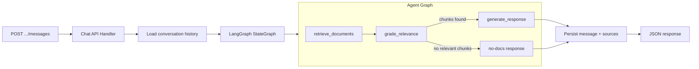

# Milestone 4: LangGraph Agent + Chat API

## Key Decisions

- **langchain-postgres `PGVector**` for retrieval (wraps the existing pgvector column behind a LangChain VectorStore interface, per user preference)
- **Cosine similarity threshold** (configurable, default 0.3) in `grade_relevance` to filter irrelevant chunks -- functional with real embeddings, no LLM needed for grading
- **Mock LLM as default**, with a config toggle for a real LLM via Ollama (`langchain-ollama`). The mock is a `BaseChatModel` subclass that templates retrieved chunks into a formatted response. Setting `LLM_PROVIDER=ollama` and `OLLAMA_MODEL=llama3` swaps in a real model.
- **JSON responses** for M4 (no SSE). Streaming deferred to M6.
- **JSON column** for source attributions on the `messages` table -- stores `[{document_id, filename, chunk_content, similarity_score}]`. This is standard practice (even production systems like ChatGPT do this) and avoids over-engineering a join table for a local single-user app.
- **Both unit and integration tests** -- unit tests exercise the LangGraph graph directly, integration tests hit the HTTP endpoints.

## Architecture




## Data Model Additions

### New tables (Alembic migrations 0003, 0004)

**conversations**:

- `id` (String PK, UUID)
- `title` (String, nullable -- auto-generated from first user message, truncated to ~100 chars)
- `created_at` (DateTime with timezone)
- `updated_at` (DateTime with timezone)

**messages**:

- `id` (String PK, UUID)
- `conversation_id` (String FK -> conversations.id, ON DELETE CASCADE)
- `role` (String, "user" or "assistant")
- `content` (Text)
- `sources` (JSON, nullable -- list of source attribution dicts for assistant messages)
- `created_at` (DateTime with timezone)

Index on `messages.conversation_id` for efficient history loading.

## New Dependencies

Added to [backend/pyproject.toml](backend/pyproject.toml):

- `langgraph>=0.2` -- agent graph orchestration
- `langchain-core>=0.3` -- base LLM abstractions, `BaseChatModel`
- `langchain-postgres>=0.0.12` -- PGVector vector store wrapper
- `langchain-ollama>=0.2` -- optional, for real LLM toggle (added to main deps so it's available when configured)

## New Files

### 1. ADR 0004 -- `.docs/adr/0004-langgraph-agent-architecture.md`

Covers: LangGraph graph design (3 nodes), mock vs real LLM strategy, retrieval via PGVector, relevance grading approach, conversation persistence.

### 2. Alembic migrations

- `backend/alembic/versions/0003_create_conversations_table.py`
- `backend/alembic/versions/0004_create_messages_table.py`

### 3. SQLAlchemy models -- add to [backend/app/db/models.py](backend/app/db/models.py)

```python
class Conversation(Base):
    __tablename__ = "conversations"
    id: Mapped[str]           # UUID PK
    title: Mapped[str | None] # auto-generated from first message
    created_at: Mapped[datetime]
    updated_at: Mapped[datetime]

class Message(Base):
    __tablename__ = "messages"
    id: Mapped[str]                # UUID PK
    conversation_id: Mapped[str]   # FK -> conversations.id, CASCADE
    role: Mapped[str]              # "user" or "assistant"
    content: Mapped[str]           # Text
    sources: Mapped[dict | None]   # JSON column
    created_at: Mapped[datetime]
```

### 4. Pydantic schemas -- `backend/app/models/conversation.py`

```python
class SourceAttribution(BaseModel):
    document_id: str
    filename: str
    chunk_content: str
    similarity_score: float

class MessageResponse(BaseModel):
    id: str
    conversation_id: str
    role: str
    content: str
    sources: list[SourceAttribution] | None
    created_at: datetime

class ConversationResponse(BaseModel):
    id: str
    title: str | None
    created_at: datetime
    updated_at: datetime

class ConversationListResponse(BaseModel):
    conversations: list[ConversationResponse]

class ConversationDetailResponse(ConversationResponse):
    messages: list[MessageResponse]

class SendMessageRequest(BaseModel):
    content: str  # validated non-empty

class SendMessageResponse(MessageResponse):
    pass  # the assistant's reply
```

### 5. Retrieval service -- `backend/app/services/retrieval.py`

Wraps pgvector behind `langchain-postgres` `PGVector`:

```python
class RetrievalService:
    def __init__(self, embedding_service: EmbeddingService, db_url: str):
        # Initialize PGVector with existing connection/table
        ...

    async def search(self, query: str, top_k: int = 5) -> list[RetrievedChunk]:
        # Embed query, run similarity search, return chunks with scores
        ...
```

`RetrievedChunk` is a dataclass with `document_id`, `chunk_content`, `chunk_index`, `similarity_score`, and `filename` (joined from documents table).

**Key detail**: The PGVector wrapper needs to work with the **existing** `chunks` table that was created in M3. We'll configure it to use that table rather than letting it create its own. If `langchain-postgres` makes this awkward, we fall back to a direct SQLAlchemy query using pgvector's `<=>` cosine distance operator -- the interface stays the same either way.

### 6. Mock LLM -- `backend/app/agent/llm.py`

```python
class MockChatModel(BaseChatModel):
    """Templates retrieved chunks into a formatted response."""
    
    def _generate(self, messages, stop=None, **kwargs):
        # Extract context from the last message (which contains retrieved chunks)
        # Return formatted: "Based on your documents: [excerpts]. Sources: [names]"
        ...

def create_llm(settings: Settings) -> BaseChatModel:
    """Factory: returns MockChatModel or ChatOllama based on config."""
    if settings.llm_provider == "ollama":
        from langchain_ollama import ChatOllama
        return ChatOllama(model=settings.ollama_model, base_url=settings.ollama_base_url)
    return MockChatModel()
```

### 7. LangGraph agent -- `backend/app/agent/graph.py`

```python
class AgentState(TypedDict):
    query: str
    conversation_history: list[dict]
    retrieved_chunks: list[RetrievedChunk]
    relevant_chunks: list[RetrievedChunk]
    response: str
    sources: list[dict]

def build_agent_graph(retrieval_service, llm, similarity_threshold=0.3) -> CompiledGraph:
    graph = StateGraph(AgentState)
    graph.add_node("retrieve_documents", retrieve_node)
    graph.add_node("grade_relevance", grade_node)
    graph.add_node("generate_response", generate_node)
    
    graph.set_entry_point("retrieve_documents")
    graph.add_edge("retrieve_documents", "grade_relevance")
    graph.add_conditional_edges("grade_relevance", has_relevant_chunks, ...)
    graph.add_edge("generate_response", END)
    
    return graph.compile()
```

Three nodes:

- **retrieve_documents**: Calls `retrieval_service.search(query, top_k=5)`, stores results in `retrieved_chunks`
- **grade_relevance**: Filters chunks below `similarity_threshold`, stores results in `relevant_chunks`. If none pass, sets `response` to a "no relevant documents found" message and routes to END.
- **generate_response**: Passes `relevant_chunks` + `conversation_history` + `query` to the LLM, stores `response` and `sources`.

### 8. Conversation service -- `backend/app/services/conversation_service.py`

CRUD operations for conversations and messages:

- `create_conversation(session) -> ConversationResponse`
- `list_conversations(session) -> list[ConversationResponse]`
- `get_conversation_with_messages(conversation_id, session) -> ConversationDetailResponse`
- `delete_conversation(conversation_id, session) -> bool`
- `add_message(conversation_id, role, content, sources, session) -> MessageResponse`
- `get_conversation_history(conversation_id, session) -> list[dict]` -- for feeding into the agent

### 9. Chat API -- `backend/app/api/conversations.py`


| Method   | Path                               | Description                                                    |
| -------- | ---------------------------------- | -------------------------------------------------------------- |
| `POST`   | `/api/conversations`               | Create a new conversation                                      |
| `GET`    | `/api/conversations`               | List all conversations                                         |
| `GET`    | `/api/conversations/{id}`          | Get conversation with all messages                             |
| `DELETE` | `/api/conversations/{id}`          | Delete conversation (messages CASCADE)                         |
| `POST`   | `/api/conversations/{id}/messages` | Send a message, invoke the agent, return the assistant's reply |


The `POST .../messages` handler:

1. Validates the conversation exists
2. Persists the user message
3. Loads conversation history
4. Invokes the LangGraph agent
5. Persists the assistant message (with sources)
6. Auto-generates conversation title from first user message if title is null
7. Returns the assistant `MessageResponse`

### 10. Config additions -- [backend/app/config.py](backend/app/config.py)

```python
llm_provider: str     # "mock" (default) or "ollama"
ollama_model: str     # default "llama3"
ollama_base_url: str  # default "http://localhost:11434"
similarity_threshold: float  # default 0.3
retrieval_top_k: int  # default 5
```

### 11. Startup wiring -- [backend/app/main.py](backend/app/main.py)

In the lifespan:

- Initialize `RetrievalService` with the embedding service and DB URL
- Create the LLM via `create_llm(settings)`
- Build and store the compiled agent graph
- Register a `get_agent` dependency for the chat router

Register `conversations_router` alongside the existing `documents_router`.

## Modified Files

- [backend/pyproject.toml](backend/pyproject.toml) -- add `langgraph`, `langchain-core`, `langchain-postgres`, `langchain-ollama`
- [backend/app/db/models.py](backend/app/db/models.py) -- add `Conversation` and `Message` models
- [backend/app/config.py](backend/app/config.py) -- add LLM and retrieval settings
- [backend/app/main.py](backend/app/main.py) -- initialize agent graph, register conversations router
- [backend/tests/conftest.py](backend/tests/conftest.py) -- add agent/retrieval fixtures, mock LLM override
- [.docs/adr/README.md](.docs/adr/README.md) -- add ADR 0004 to the index

## Tests

### Unit tests -- `backend/tests/test_agent.py`

- Agent returns a formatted response when relevant chunks are found in vector store
- Agent returns "no relevant documents" when similarity scores are all below threshold
- Agent returns "no relevant documents" when vector store is empty
- Grade node filters chunks below the similarity threshold
- Conversation history is included in LLM prompt
- Source attributions are correctly structured in the response

### Integration tests -- `backend/tests/test_conversations.py`

- `POST /api/conversations` creates a conversation and returns it
- `GET /api/conversations` lists conversations ordered by updated_at
- `GET /api/conversations/{id}` returns conversation with messages
- `DELETE /api/conversations/{id}` deletes conversation and messages
- `DELETE /api/conversations/{id}` returns 404 for nonexistent ID
- `POST /api/conversations/{id}/messages` with documents in DB returns response with sources
- `POST /api/conversations/{id}/messages` with empty DB returns "no relevant documents"
- `POST /api/conversations/{id}/messages` with empty content returns 422
- `POST /api/conversations/{id}/messages` with invalid conversation ID returns 404
- Conversation title is auto-generated from first user message
- Multiple messages in a conversation are ordered by created_at

## Commit Plan

1. `docs(adr): add ADR 0004 for LangGraph agent architecture`
2. `feat(db): add conversation and message models with migrations` -- SQLAlchemy models, Alembic migrations, Pydantic schemas
3. `feat(agent): add retrieval service with PGVector integration` -- retrieval.py, search against existing chunks table
4. `feat(agent): add mock LLM with Ollama config toggle` -- llm.py, config additions
5. `feat(agent): add LangGraph RAG agent graph` -- graph.py with 3 nodes, unit tests
6. `feat(chat): add conversation CRUD and chat API endpoints` -- conversation_service.py, conversations.py router, main.py wiring, integration tests

