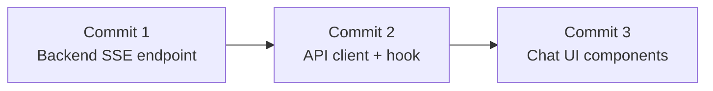

# Milestone 6: Frontend Chat Interface + SSE Streaming

## Scope

Two tracks of work: (A) add an SSE streaming endpoint to the backend, and (B) build the full chat UI on the frontend.

## A. Backend -- SSE Streaming Endpoint

### New endpoint: `POST /api/conversations/{id}/messages/stream`

Add a new endpoint alongside the existing synchronous `POST .../messages`. The new endpoint returns an SSE stream (`text/event-stream`) with structured events. The existing synchronous endpoint stays unchanged (tests and non-streaming clients still work).

**SSE event format** (one JSON object per `data:` line):

```
event: message_start
data: {"message_id": "...", "conversation_id": "..."}

event: content_delta
data: {"delta": "Based on"}

event: content_delta
data: {"delta": " your documents..."}

event: sources
data: {"sources": [{...}, {...}]}

event: message_end
data: {"message_id": "..."}
```

Since the `MockChatModel` (and even Ollama) produces the full response synchronously, the SSE handler will simulate token-level streaming by chunking the completed response string into small pieces (~4-8 word groups) and yielding them as `content_delta` events. This gives the frontend a real SSE consumer to integrate with, and the pattern naturally extends to true token streaming if a streaming-capable LLM is used later.

**Files to modify/create:**

- [backend/app/api/conversations.py](backend/app/api/conversations.py) -- add `send_message_stream` route returning `StreamingResponse`
- [backend/app/models/conversation.py](backend/app/models/conversation.py) -- add SSE event schemas (optional, mostly for documentation; the events are simple dicts serialized to JSON)

**Key implementation details:**

- Use `fastapi.responses.StreamingResponse` with `media_type="text/event-stream"` and headers `Cache-Control: no-cache`, `Connection: keep-alive`, `X-Accel-Buffering: no`
- Reuse the same agent invocation (`agent.ainvoke`) and conversation service logic as the sync endpoint
- Persist the user message before streaming, persist the assistant message after the full response is assembled
- The async generator yields SSE-formatted strings

**Test:** Add a test in [backend/tests/test_conversations.py](backend/tests/test_conversations.py) that hits the streaming endpoint and validates the SSE event sequence (`message_start` -> 1+ `content_delta` -> `sources` -> `message_end`).

---

## B. Frontend -- New Files

### 1. API client: `frontend/src/api/conversations.ts`

Follow the same pattern as [frontend/src/api/documents.ts](frontend/src/api/documents.ts). Functions:

- `createConversation()` -- POST `/api/conversations`
- `fetchConversations()` -- GET `/api/conversations`
- `fetchConversation(id)` -- GET `/api/conversations/{id}`
- `deleteConversation(id)` -- DELETE `/api/conversations/{id}`
- `sendMessageStream(conversationId, content, onDelta, onSources, onComplete, onError)` -- POST `.../messages/stream`, consume SSE via `fetch` + `ReadableStream` (no library needed; native `getReader()` with a `TextDecoder` to parse `event:`/`data:` lines)

Types: `ConversationResponse`, `ConversationListResponse`, `ConversationDetailResponse`, `MessageResponse`, `SourceAttribution`, `SendMessageRequest` -- all mirroring the backend Pydantic schemas.

### 2. Hook: `frontend/src/hooks/useChat.ts`

Manages the active conversation state. Follow the same `useState` + `useCallback` pattern as [frontend/src/hooks/useDocuments.ts](frontend/src/hooks/useDocuments.ts).

State:

- `conversations: ConversationResponse[]` -- loaded on mount
- `activeConversationId: string | null`
- `messages: MessageResponse[]` -- loaded when active conversation changes
- `sending: boolean` -- true while SSE stream is in flight
- `streamingContent: string` -- accumulates `content_delta` events for the in-progress assistant message
- `error: string | null`

Exposed actions:

- `createConversation()` -- creates + selects it
- `selectConversation(id)` -- loads messages
- `deleteConversation(id)` -- deletes + selects next or null
- `sendMessage(content)` -- optimistically appends user message, calls SSE endpoint, accumulates streaming content, finalizes assistant message on `message_end`
- `clearError()`

### 3. Component: `frontend/src/components/ChatInterface.tsx`

The main chat panel. Sub-sections (can be inline or extracted):

- **ConversationSelector** (top bar): dropdown showing conversations list with title (or "New conversation" fallback), "New conversation" button, delete button for active conversation. Rendered at the top of `<main>`.
- **MessageList**: scrollable area rendering messages. User messages right-aligned with a distinct background. Assistant messages left-aligned with markdown rendering. While `sending` is true, show the `streamingContent` as a "typing" assistant message with a blinking cursor indicator.
- **SourcesPanel**: below each assistant message that has sources, show a collapsible "Sources (N)" section. Each source shows the filename and a truncated chunk snippet. Clicking expands to show the full chunk.
- **MessageInput**: fixed at the bottom. A `<textarea>` (auto-grows) + send button. Enter sends (Shift+Enter for newline). Disabled while `sending`.

### 4. Markdown rendering

Install `react-markdown` (lightweight, zero-config). Use it to render assistant message content. No need for syntax highlighting or plugins -- just basic markdown (bold, italic, lists, headings, code blocks).

---

## C. Frontend -- Modified Files

### `frontend/src/App.tsx`

Replace the placeholder `<main>` content with `<ChatInterface />`. Wire up the `useChat` hook at the `App` level (or inside `ChatInterface`).

The layout stays `grid-cols-[320px_1fr]` -- documents sidebar on the left, chat panel on the right. The conversation selector lives inside the chat panel header area (per user preference: "at the top of the main chat panel as a dropdown/selector").

---

## D. Architecture Decisions

No new ADR needed. SSE streaming is an implementation detail of an existing endpoint pattern, not a structural/architectural decision that would be non-obvious or hard to reverse.

---

## E. Commit Plan

1. `**feat(api): add SSE streaming endpoint for chat messages**` -- backend streaming endpoint + test
2. `**feat(ui): add conversation API client and useChat hook**` -- `conversations.ts` + `useChat.ts`
3. `**feat(ui): add chat interface with streaming and sources**` -- `ChatInterface.tsx`, `App.tsx` changes, `react-markdown` dependency




