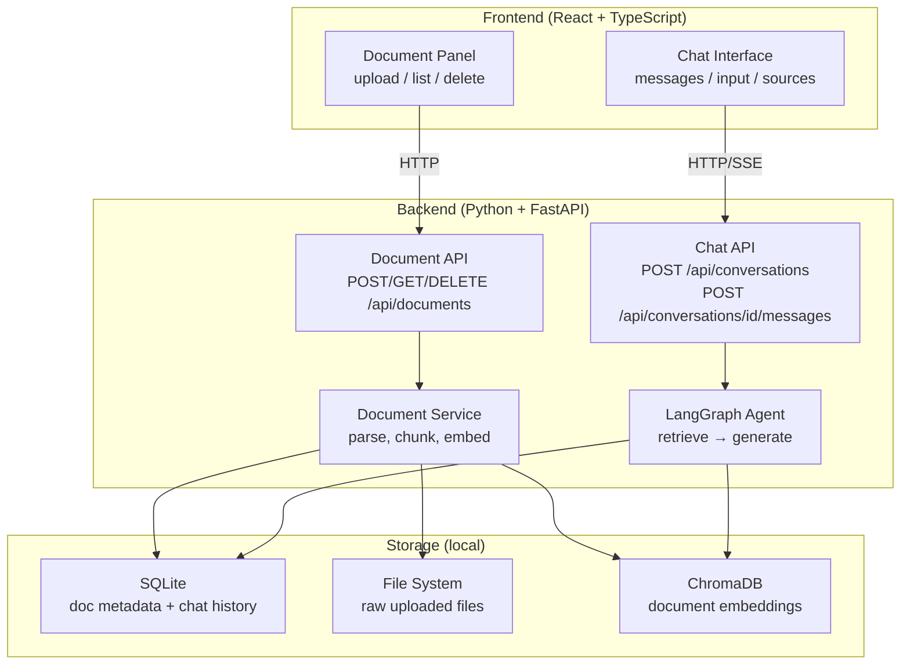
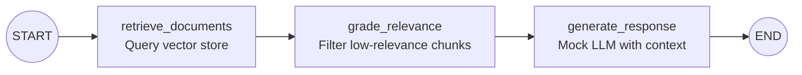

# NotebookLM Implementation Plan

## 1. Requirements Summary

From [.docs/PROMPT.md](.docs/PROMPT.md):

- **Upload documents** (no format preference)
- **Delete documents**
- **Chat with an agent** that answers questions based on document content
- **Local-only** -- no cloud deployment
- **Mock LLM acceptable** -- evaluation is on design and implementation, not answer quality
- **Stack**: React UI, Python backend, LangChain/LangGraph for agent orchestration
- **Bonus**: Creative additions encouraged

## 2. Ambiguities and Assumptions

| Area               | Ambiguity                                          | Assumption                                                                                                                                                                                                     |
| ------------------ | -------------------------------------------------- | -------------------------------------------------------------------------------------------------------------------------------------------------------------------------------------------------------------- |
| File formats       | "No preference" -- which to support?               | Support **PDF, TXT, and Markdown** at minimum. Extensible design for adding formats.                                                                                                                           |
| Embeddings         | Prompt says mock LLM is fine, silent on embeddings | Use **real local embeddings** (sentence-transformers `all-MiniLM-L6-v2`, ~80MB, free, offline). Makes retrieval functional without paying for API tokens.                                                      |
| LLM                | "Mock LLM" -- how sophisticated?                   | Use LangChain's `FakeListLLM` with a thin wrapper that formats retrieved context into responses. The mock should demonstrate the pipeline works end-to-end even though answers aren't semantically meaningful. |
| Chat               | "Chat experience" -- multi-turn?                   | Yes, support **conversation history** with multiple turns. Maintain context within a conversation.                                                                                                             |
| Users              | Single user or multi-user?                         | **Single user**, no authentication. Runs locally.                                                                                                                                                              |
| Streaming          | Should responses stream?                           | **Yes** via Server-Sent Events (SSE). Streaming is expected in a modern chat UX and demonstrates async competence. Implement as an enhancement in a later milestone if time is tight.                          |
| Documents in scope | All docs or per-conversation?                      | Agent searches **all uploaded documents** by default.                                                                                                                                                          |

## 3. High-Level Architecture

### Key modules

- `**backend/app/api/**` -- FastAPI route handlers (documents, chat)
- `**backend/app/services/**` -- Business logic (document processing, storage)
- `**backend/app/agent/**` -- LangGraph agent definition, mock LLM, retrieval tools
- `**backend/app/models/**` -- Pydantic schemas for API request/response
- `**backend/app/db/**` -- SQLite connection, migrations, repository layer
- `**frontend/src/components/**` -- React components (DocumentPanel, ChatInterface)
- `**frontend/src/api/**` -- API client functions
- `**frontend/src/hooks/**` -- Custom hooks for data fetching and state

### LangGraph Agent Design

The graph is intentionally kept to 3 nodes for the initial implementation. This is the simplest design that genuinely uses LangGraph (not just a linear chain). The `grade_relevance` node demonstrates conditional logic -- if no relevant chunks are found, it returns a "no relevant documents" response directly. This can be extended later with query rewriting or multi-step reasoning.

### Data Model

**documents table** (SQLite):

- `id` (UUID, PK), `filename`, `content_type`, `file_size`, `chunk_count`, `created_at`

**conversations table**:

- `id` (UUID, PK), `title`, `created_at`, `updated_at`

**messages table**:

- `id` (UUID, PK), `conversation_id` (FK), `role` (user/assistant), `content`, `sources` (JSON -- list of doc references), `created_at`

**Vector store** (ChromaDB): collection per nothing special -- single collection, metadata includes `document_id` and `chunk_index` for source attribution.

## 4. ADRs to Write

- **ADR 0002**: Data storage strategy (SQLite + filesystem + ChromaDB)
- **ADR 0003**: Document processing and embedding approach
- **ADR 0004**: LangGraph agent architecture

Each written before implementing the relevant milestone.

## 5. Milestones

### Milestone 1: Project Scaffold

**Goal**: Both servers run, communicate, and have a passing test.

**Backend**:

- FastAPI project in `backend/` with `pyproject.toml` (dependencies: fastapi, uvicorn, pydantic, pytest, httpx)
- Directory structure: `app/{api,models,services,agent,db}`, `tests/`
- `GET /api/health` endpoint returning `{"status": "ok"}`
- pytest configured and passing

**Frontend**:

- Vite + React + TypeScript in `frontend/`
- Minimal app shell with two-panel layout placeholder
- Vite proxy to backend for `/api/*`
- Build succeeds, dev server runs

**Tests**: Health check endpoint test. Frontend builds without errors.

**Commits**: ~2-3 (backend scaffold, frontend scaffold, proxy config)

---

### Milestone 2: Document Management API

**Goal**: Full document CRUD over HTTP, persisted to SQLite + filesystem.

**Write ADR 0002** (data storage strategy) before starting.

- SQLite setup with schema migration (simple `CREATE TABLE IF NOT EXISTS`)
- `POST /api/documents` -- multipart upload, store file to `data/uploads/`, insert metadata row
- `GET /api/documents` -- list all documents with metadata
- `DELETE /api/documents/{id}` -- remove file, delete metadata, delete vector embeddings
- Pydantic models for `DocumentResponse`, `DocumentListResponse`
- Input validation: reject empty files, validate allowed extensions

**Tests**:

- Upload a file, verify it's stored and metadata returned
- List documents after upload
- Delete a document, verify file and metadata removed
- Error cases: empty file, unsupported format, delete nonexistent ID

**Commits**: ~3 (DB setup + models, upload/list endpoints, delete endpoint)

---

### Milestone 3: Document Processing Pipeline

**Goal**: Uploaded documents are parsed, chunked, embedded, and stored in a vector store for retrieval.

**Write ADR 0003** (processing and embedding approach) before starting.

- Text extraction: `pypdf` for PDF, plain read for TXT/MD
- Chunking with LangChain's `RecursiveCharacterTextSplitter` (chunk size ~500 tokens, ~100 overlap)
- Embeddings via `sentence-transformers` (`all-MiniLM-L6-v2`) through LangChain's `HuggingFaceEmbeddings`
- ChromaDB as local persistent vector store
- Processing triggered synchronously on upload (acceptable for local single-user)
- Store `document_id` and `chunk_index` as metadata in ChromaDB for source attribution

**Tests**:

- Parse each supported format and verify extracted text
- Chunk a known text, verify chunk sizes and overlap
- Embed and store chunks, then query and verify retrieval
- Delete document and verify chunks removed from vector store

**Commits**: ~3 (text extraction, chunking + embedding, ChromaDB integration)

---

### Milestone 4: LangGraph Agent + Chat API

**Goal**: A working RAG agent accessible via HTTP. This is the core of the assessment.

**Write ADR 0004** (agent architecture) before starting.

- LangGraph `StateGraph` with nodes: `retrieve_documents`, `grade_relevance`, `generate_response`
- Mock LLM: wraps `FakeListLLM` or a custom callable that templates retrieved chunks into a response string (e.g., "Based on the documents: {chunk_summaries}. [Source: {doc_name}]")
- Conversation and message persistence in SQLite
- `POST /api/conversations` -- create a new conversation
- `GET /api/conversations` -- list conversations
- `POST /api/conversations/{id}/messages` -- send a message, get agent response (SSE or JSON)
- Response includes source attributions (document name, chunk snippet)

**Tests**:

- Agent returns a response given documents in the vector store
- Agent returns "no relevant documents" when vector store is empty
- Chat history is persisted and retrievable
- Source attributions are present in response
- Error cases: invalid conversation ID, empty message

**Commits**: ~4 (agent graph, mock LLM, chat API endpoints, conversation persistence)

---

### Milestone 5: Frontend -- Document Management

**Goal**: Users can upload, view, and delete documents through the UI.

- API client module (`frontend/src/api/`) with typed functions for document endpoints
- `DocumentPanel` component: file upload (click or drag-and-drop), document list, delete button
- Upload progress indicator
- Error and empty states
- Use React hooks for data fetching (keep it simple -- `useState` + `useEffect` or a lightweight fetcher)

**Tests**: Manual verification + optional component tests if time allows.

**Commits**: ~2-3 (API client, document panel component, styling/polish)

---

### Milestone 6: Frontend -- Chat Interface

**Goal**: Users can have conversations with the agent through a chat UI.

- `ChatInterface` component: message list, input form, send button
- Conversation list/selector in sidebar or header
- Render assistant messages with Markdown support
- Display source attributions (document name, expandable snippet)
- SSE integration for streaming responses (or poll-based fallback)
- Auto-scroll to newest message

**Tests**: Manual verification. Focus on error states (network failure, empty conversation).

**Commits**: ~3 (chat UI, conversation management, source display + streaming)

---

### Milestone 7: Polish, Documentation, and Creative Additions

**Goal**: Production-quality finish. Comprehensive README. Bonus features.

- Error handling audit: every API error returns structured JSON, frontend shows user-friendly messages
- Loading skeletons / spinners
- Empty states with helpful copy ("Upload a document to get started")
- **README.md**: setup instructions, architecture overview, design decisions, trade-offs, future improvements
- **Creative additions** (pick based on remaining time):
  - Background processing with status polling: documents gain a `status` field (`pending`/`processing`/`ready`/`failed`) with `error_message`; upload returns immediately via `BackgroundTasks`, frontend polls `GET /api/documents/{id}` to track progress (no event bus -- single producer/consumer doesn't justify the abstraction)
  - Duplicate document detection: SHA-256 content hash on upload; 409 Conflict if an identical file already exists
  - Document statistics: `word_count`, `page_count` (PDFs), `estimated_reading_time_seconds` computed during extraction and returned in the API
  - Chunk provenance: each chunk stores `start_char`/`end_char` offsets into the extracted text, enabling source highlighting in the document viewer
  - Source highlighting: click a source attribution to see the relevant chunk in context (builds on chunk provenance)
  - Conversation titles auto-generated from first message
  - Document format badges and file size display
  - Keyboard shortcuts (Enter to send, Ctrl+N for new conversation)
  - Dark mode
  - Migration/model drift safety: CI check via `alembic check` or `alembic revision --autogenerate` that fails if models and migrations are out of sync
  - Migration round-trip test: `alembic upgrade head` → `alembic downgrade base` → `alembic upgrade head` to verify the full migration path
  - Integration test suite that runs against a real PostgreSQL container (via docker-compose or testcontainers) instead of SQLite, exercising the actual Alembic migration path

**Commits**: ~3-4 (error handling, UI polish, README, bonus features)

## 6. Dependency Summary

**Backend** (`pyproject.toml`):

- `fastapi`, `uvicorn` -- HTTP server
- `python-multipart` -- file uploads
- `pydantic` -- validation
- `aiosqlite` -- async SQLite
- `langchain`, `langchain-community`, `langgraph` -- agent orchestration
- `chromadb` -- vector store
- `sentence-transformers` -- local embeddings
- `pypdf` -- PDF parsing
- `pytest`, `httpx`, `pytest-asyncio` -- testing

**Frontend** (`package.json`):

- `react`, `react-dom` -- UI
- `typescript` -- type safety
- `vite` -- build tool
- (CSS approach: keep it simple -- CSS modules or Tailwind, decide during scaffold)

