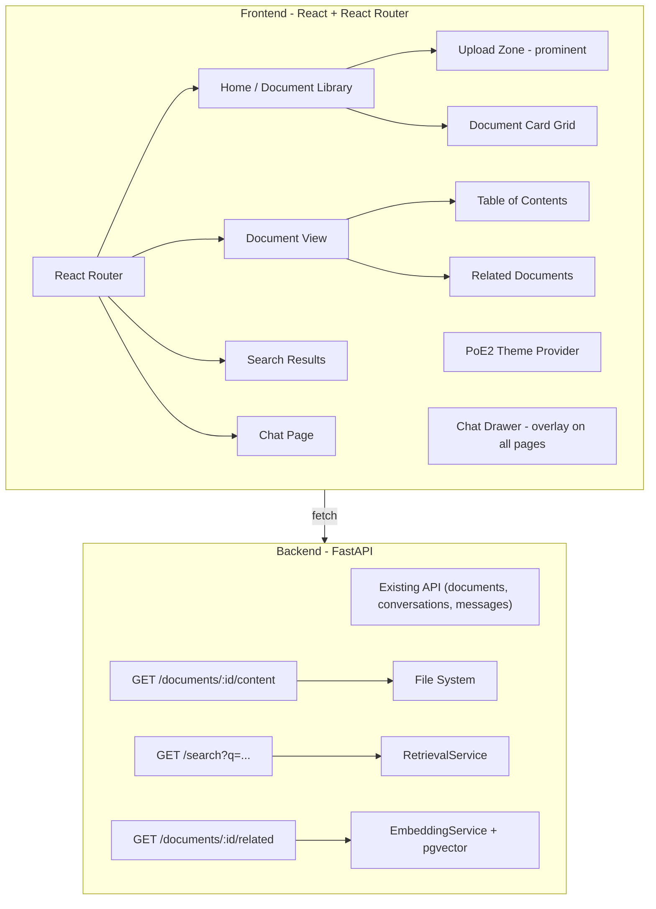

# PoE2 Wiki Frontend Overhaul

## 1. Requirements Summary

Source: [PROMPT.md](PROMPT.md) core requirements (already met by current backend) plus user's creative extension:

- **Core requirement: Upload, browse, search, and chat about any documents** -- the app must work perfectly with zero seed data. A reviewer who uploads a PDF and asks questions should have a seamless experience.
- **PoE2 theming is a visual skin**, not a content assumption -- all labels, empty states, and flows are generic ("your documents", "knowledge base") with PoE2 aesthetic treatment on top
- **Heavy PoE2 theming** -- ornate borders, background textures, gold accents, immersive dark aesthetic
- **Upload is first-class** -- prominent on the home page and accessible from the header, not buried in a sidebar
- **React Router** with distinct pages: home/library, document view, search results, and chat
- **New backend endpoints** to support browsing (document content, standalone search, related pages)
- **Progressive delivery** from foundational infrastructure through polish
- Static assets (fonts, textures, decorative SVGs) are acceptable
- When PoE2 wiki content IS seeded, internal wiki links between pages work and the experience feels like a themed wiki

## 2. Ambiguities and Assumptions

| Area                      | Ambiguity                                                                             | Assumption                                                                                                                                            |
| ------------------------- | ------------------------------------------------------------------------------------- | ----------------------------------------------------------------------------------------------------------------------------------------------------- |
| Zero-data experience      | Reviewers may not seed PoE2 wiki data                                                 | The app must be fully functional with zero documents. Home page shows a compelling upload CTA. All flows work for user-uploaded PDFs/TXTs/MDs.        |
| Document content endpoint | Files exist on disk at `upload_dir/{doc_id}/{filename}` but no API serves raw content | Add `GET /api/documents/{id}/content` that reads from disk and returns the raw text/markdown                                                          |
| Non-markdown documents    | Users may upload PDFs or plain text, not just markdown                                | Article view renders markdown richly; for plain text, displays as-is; for PDFs, displays the extracted text. All get ToC if headings are present.     |
| Internal wiki links       | Seeded wiki markdown contains links like `[text](/wiki/Page "Page")`                  | Parse during rendering and map to document ID lookups; unresolved links render as styled plain text (not broken links)                                |
| PoE2 game assets          | No license to use official GGG art                                                    | Use CSS-only theming (gradients, borders, shadows, textures) plus Google Fonts (Cinzel, Fira Sans); generate decorative SVGs; no copyrighted game art |
| Search endpoint           | Backend has `RetrievalService.search()` but no HTTP endpoint outside the chat agent   | Add `GET /api/search?q=...` that calls `RetrievalService` directly and returns ranked results                                                         |
| Related documents         | Semantic similarity exists in embeddings but no "related documents" API               | Add `GET /api/documents/{id}/related` using average embedding similarity between documents                                                            |
| Document title            | Filenames like `Life.md` or `report.pdf` serve as titles                              | Strip extension and humanize filename as display title (e.g., `Life.md` -> "Life", `quarterly_report.pdf` -> "Quarterly Report")                      |
| Mobile/responsive         | No mobile requirement stated                                                          | Build responsive from the start, but desktop is primary                                                                                               |

## 3. High-Level Architecture

**Key modules:**

- `frontend/src/pages/` -- Route-level page components (Home, Document, Search, Chat)
- `frontend/src/components/document/` -- Document display components (ArticleRenderer, TableOfContents, RelatedDocuments)
- `frontend/src/components/chat/` -- Chat drawer and related (refactored from existing ChatInterface)
- `frontend/src/components/layout/` -- Shell components (Header, Footer)
- `frontend/src/components/upload/` -- Upload components (UploadZone, refactored from existing DocumentUpload)
- `frontend/src/components/ui/` -- Reusable themed primitives (Card, Button, Input, Badge, Skeleton)
- `frontend/src/api/` -- Existing + new API client functions (search, content, related)
- `frontend/src/hooks/` -- Existing + new hooks (useSearch, useArticle, useRelatedDocuments)
- `frontend/src/lib/` -- Utility functions (slug mapping, title derivation, wiki link parsing)
- `backend/app/api/search.py` -- New search endpoint
- `backend/app/api/documents.py` -- Extended with content and related endpoints

**Data model -- no new tables needed.** New endpoints query existing `documents` and `chunks` tables. The content endpoint reads raw files from disk.

## 4. ADRs to Write

1. **ADR-0007: Frontend routing and page architecture** -- React Router v7, route structure, code splitting strategy
2. **ADR-0008: PoE2 design system approach** -- Theme tokens, font choices, CSS strategy (Tailwind v4 `@theme` + custom properties), texture/asset approach

## 5. Milestones

### Milestone 1: Design System and App Shell (essential)

**Goal:** The app has React Router, a PoE2-themed layout shell, and all existing functionality still works.

**Implementation details:**

- Install `react-router` (v7)
- Define PoE2 theme tokens in `index.css` via Tailwind `@theme`:
  - Colors: `--color-bg-primary: #0c0c14`, `--color-bg-secondary: #141420`, `--color-accent-gold: #c8aa6e`, `--color-accent-gold-dim: #8b7a4a`, `--color-accent-crimson: #8b2500`, `--color-text-primary: #e8dcc8`, `--color-text-secondary: #9b8e7e`, `--color-border: #2a2a3a`
  - Fonts: Cinzel (Google Fonts) for headings, Fira Sans for body
- Create `Layout` component with:
  - Themed header: app branding ("Exile's Archive" or similar), nav links (Home, Chat), search trigger, upload button
  - Main content `<Outlet>`
  - Footer with attribution
- Add subtle CSS background texture (repeating noise pattern via CSS gradient or tiny inline SVG)
- Decorative elements: gold 1px borders, subtle box shadows with amber tint, corner flourishes on cards via CSS `::before`/`::after`
- Set up routes: `/` (home/library), `/doc/:slug` (document view), `/search` (results), `/chat` (full chat page)
- Move existing components into appropriate routes while preserving all functionality
- Create themed UI primitives: `Card`, `Button`, `Input`, `Badge`, `Skeleton`
- Write ADR-0007 and ADR-0008

**Tests:**

- All existing API calls still work through the new layout
- Routes render correct page components
- Theme tokens apply correctly (visual check)

**Commits:** ~4 (ADRs, router + layout shell, theme system + primitives, route migration of existing components)

---

### Milestone 2: Backend -- Document Browsing Endpoints (essential)

**Goal:** Three new API endpoints serve document content, standalone search, and related documents.

**Implementation details:**

- `GET /api/documents/{document_id}/content` in [backend/app/api/documents.py](backend/app/api/documents.py):
  - Read raw file from `upload_dir/{doc_id}/{filename}`
  - Return `{ "id", "filename", "title", "content": "<full markdown>", "chunk_count", "created_at" }`
  - 404 if document or file not found
- `GET /api/search?q=...&limit=10&offset=0` in new `backend/app/api/search.py`:
  - Validate `q` is non-empty
  - Call `RetrievalService.search()` from [backend/app/services/retrieval.py](backend/app/services/retrieval.py)
  - Return `{ "results": [{ "document_id", "filename", "title", "section_heading", "snippet", "score" }], "total", "query" }`
  - Group results by document, return best chunk per document for the results list
- `GET /api/documents/{document_id}/related?limit=5` in documents router:
  - Compute average embedding for the target document's chunks
  - Find top-N other documents by cosine similarity of their average embeddings
  - Return `{ "documents": [{ "id", "filename", "title", "score" }] }`
  - Gracefully return empty list when only 1 document exists
- Register new router in [backend/app/main.py](backend/app/main.py)
- Add corresponding Pydantic response models in [backend/app/models/document.py](backend/app/models/document.py)

**Tests:**

- Content endpoint: happy path (returns full text), 404 for missing doc, 404 for missing file on disk, works for markdown and plain text files
- Search endpoint: returns results for valid query, empty results for no-match, validates empty query, returns empty when no documents exist
- Related endpoint: returns other documents (not self), respects limit, 404 for missing doc, empty when only 1 doc
- Integration tests with seeded test data

**Commits:** ~3 (content endpoint + tests, search endpoint + tests, related endpoint + tests)

---

### Milestone 3: Home Page / Document Library (essential)

**Goal:** Users land on a themed home page that prominently features document upload alongside a browsable document grid. Works great with zero documents.

**Implementation details:**

- Home page at `/` with:
  - Hero section: app branding with PoE2 styling, subtitle: "Upload documents and explore your knowledge base with AI-powered search and chat"
  - **Prominent upload zone** -- large, themed drag-and-drop area (refactored from existing `DocumentUpload`), visible above the document grid. Accepts PDF, TXT, MD. This is the first thing a new user sees when no documents exist.
  - Grid of document cards using existing `GET /api/documents` endpoint
  - Each card shows: title (derived from filename), file type badge (PDF/TXT/MD), chunk count as "sections", created date, delete action
  - Cards link to `/doc/{slug}` where slug is derived from document ID + filename
- **Empty state (zero documents):** Full-page themed CTA with upload zone, explanation of what the app does ("Upload your documents to get started. Ask questions, search content, and explore connections between your files."), and a list of supported file types
- **With documents:** Upload zone shrinks to a compact bar above the grid; can expand on click
- `useDocumentLibrary` hook wrapping the documents API with title derivation and slug mapping
- Filename-to-title utility (e.g., `Life.md` -> "Life", `quarterly_report.pdf` -> "Quarterly Report", `my-notes.txt` -> "My Notes")
- Client-side filtering: text filter input to narrow displayed pages
- Sort controls: alphabetical, newest, most sections
- Loading state with skeleton cards

**Tests:**

- Empty state renders upload CTA when no documents exist
- Upload works from the home page and new document appears in grid
- Page renders document cards from API
- Filter narrows displayed results
- Cards link to correct document routes
- Delete works from card actions
- Skeleton shows during loading

**Commits:** ~3 (home page layout + empty state, document grid with cards, filtering + sort + upload integration)

---

### Milestone 4: Document View (essential)

**Goal:** Users can read any uploaded document with rich rendering, a table of contents, and related documents.

**Implementation details:**

- Document page at `/doc/:slug`:
  - Fetch content via `GET /api/documents/{id}/content` (slug encodes the document ID)
  - Three-column layout: ToC sidebar (left, collapsible) | document content (center) | related documents (right, collapsible)
- `DocumentRenderer` component:
  - **Markdown files:** Custom `react-markdown` renderers for: tables (styled with PoE2 borders), headings (with anchor IDs), links, blockquotes (styled as callout boxes), code blocks. If content contains wiki-style links (`[text](/wiki/Page)`), resolve them to internal routes where possible; unresolved links render as styled plain text.
  - **Plain text files:** Render in a styled `<pre>` block with the same theme treatment
  - **PDF-extracted text:** Same as plain text (backend already extracts text during processing)
  - Add `remark-gfm` for table support in markdown
  - Parse headings to generate ToC data (works for markdown; plain text gets no ToC)
- `TableOfContents` component:
  - Generated from document headings (H2, H3) when present
  - Sticky positioning, scroll-spy highlighting of current section
  - Hidden when document has no headings (e.g., plain text, short documents)
  - Collapsible on smaller screens
- `RelatedDocuments` panel:
  - Fetch via `GET /api/documents/{id}/related`
  - Show as a sidebar list of linked document cards
  - Hidden when fewer than 2 total documents exist (nothing to relate to)
- "Ask about this document" floating button that opens the chat drawer with document context
- Breadcrumb: Home > Document Title
- Document metadata bar: filename, file type, size, upload date, chunk count

**Tests:**

- Markdown document renders with styled tables, headings, links
- Plain text document renders in styled pre block
- ToC generates from headings and links to anchors
- ToC hides when no headings present
- Internal wiki links navigate when target exists, render as text when not
- Related documents load and display
- 404 state for missing documents

**Commits:** ~4 (document page + renderer, ToC with scroll-spy, related documents panel, wiki link handling)

---

### Milestone 5: Search (core)

**Goal:** Users can search across all uploaded document content from a persistent search bar and view ranked results.

**Implementation details:**

- Search input in the header (persistent across all pages):
  - Debounced input (300ms)
  - `Cmd/Ctrl+K` keyboard shortcut to focus
  - On submit, navigate to `/search?q=...`
- Search results page at `/search`:
  - Call `GET /api/search?q=...`
  - Display results as cards: document title, section heading, relevance score badge, snippet with matched terms
  - Each result links to `/doc/{slug}#section` (deep-linking to section)
  - Empty state with no documents: "Upload documents to start searching" with upload CTA
  - Empty state with documents but no matches: "No results found for ..."
  - Loading state with skeleton results
- `useSearch` hook managing query state, debounce, and API calls
- New API client function in `frontend/src/api/search.ts`

**Tests:**

- Search navigates to results page
- Results display with snippets and scores
- Clicking result navigates to document
- Empty query shows appropriate state
- Keyboard shortcut focuses search input

**Commits:** ~2 (search bar + results page, keyboard shortcuts + polish)

---

### Milestone 6: Chat Drawer (core)

**Goal:** A slide-out chat drawer is accessible from any page, enabling users to ask questions about their uploaded documents.

**Implementation details:**

- `ChatDrawer` component:
  - Slides in from the right edge, overlays content (not pushes)
  - Toggle button fixed at bottom-right corner (themed orb/gem icon)
  - Width: ~420px, full height, dark themed panel
  - Draggable edge to resize (stretch goal)
- Refactor existing `ChatInterface` into drawer-compatible components:
  - Move conversation selector, message list, message input into reusable sub-components
  - Conversation state persists across page navigation (lifted to app level)
- Theme the assistant persona:
  - Display name: "The Archivist" with a themed avatar
  - Assistant messages styled with subtle gold border accent
  - Custom empty state: "I am The Archivist. Ask me anything about your uploaded documents..."
  - Messaging is generic to any documents, not PoE2-specific -- but the visual treatment is themed
- "Ask about this document" integration:
  - Button on document pages pre-fills message with "Tell me about [Document Title]"
  - Opens drawer if closed
- Source citations as clickable links to `/doc/{slug}#section`
- Empty state when no documents uploaded: "Upload documents first, then ask me anything about them"
- Preserve existing streaming, typing indicator, conversation management
- `/chat` route also available as a full-page chat experience (for users who prefer it)

**Tests:**

- Drawer opens/closes correctly
- Chat functionality works (send message, receive stream)
- "Ask about this document" pre-fills and opens drawer
- Source citations link to correct documents
- Drawer persists conversation across page navigation
- Chat works with user-uploaded documents (not just wiki content)

**Commits:** ~3 (drawer shell + toggle, chat refactor into drawer, contextual features + source linking)

---

### Milestone 7: Visual Polish and Advanced Features (nice-to-have)

**Goal:** The app feels premium with smooth transitions, loading states, and advanced navigation features.

**Implementation details:**

- **Page transitions:** Fade/slide transitions between routes using CSS transitions or `react-transition-group`
- **Skeleton loading:** Themed skeleton components for article, card grid, search results (dark shimmer effect matching PoE2 palette)
- **Hover previews:** On internal document links, show a small preview card (fetch first chunk of target document) on hover with a delay
- **Recently viewed:** Track last ~10 viewed documents in localStorage, show on home page
- **Scroll-to-top:** Smooth scroll on route change
- **Keyboard shortcuts:** `/` focuses search, `Esc` closes drawer
- **Item rarity color language:** Use PoE2 rarity colors as semantic accents:
  - Normal (white/gray) for standard content
  - Magic (blue) for links and interactive elements
  - Rare (yellow) for highlighted/important content
  - Unique (orange) for special callouts or high-relevance search results
- **Responsive refinements:** Collapsible ToC and related panels on tablet, stacked layout on mobile
- **Error boundaries:** Themed error states ("The path ahead is shrouded in darkness...")
- **Custom 404 page:** PoE2-themed not-found page

**Tests:**

- Skeleton states appear during loading
- Keyboard shortcuts work
- Page transitions don't break navigation
- Responsive breakpoints render correctly
- Error boundaries catch and display errors gracefully

**Commits:** ~4 (skeletons + transitions, hover previews + recently viewed, keyboard shortcuts + responsive, error boundaries + 404)

## 6. Dependency Summary

**Frontend:**

- `react-router` (v7) -- Client-side routing with nested layouts
- `remark-gfm` -- GitHub Flavored Markdown (tables, strikethrough) in react-markdown
- No other new runtime dependencies planned; Tailwind v4, react-markdown, React 19 are already in place

**Backend:**

- No new dependencies; new endpoints use existing SQLAlchemy, pgvector, and RetrievalService

**Assets (loaded via CSS/HTML, not npm):**

- Google Fonts: Cinzel (headings), Fira Sans (body)
- CSS-generated textures and decorative elements (no external image files needed)

