# Polish and Submission Readiness Plan

## 1. Requirements Summary

This plan covers post-implementation polish for a completed take-home assessment ([.docs/PROMPT.md](.docs/PROMPT.md)). The core features (document upload/delete, RAG chat, search) are built and tested. The remaining work targets evaluation signals that distinguish a strong senior SWE submission:

- **Operational fluency**: CI pipeline on GitHub proving tests pass automatically
- **Product thinking**: UX details that show awareness of the user's experience beyond functional correctness
- **Engineering judgment**: Error handling that degrades gracefully; scope decisions explained, not just implemented
- **Communication**: A README that respects the evaluator's time and tells the story of the project
- **Submission**: Plans directory included as an audit trail of process and AI tool usage (satisfies the prompt's "save your LLM/Agent chat history" intent in a more structured, reviewer-friendly form)

Key constraint from the [glossary](.cursor/rules/glossary.mdc): nothing here should qualify as over-engineering -- each item either solves a stated requirement (README, chat history) or is a small, justified improvement that a reviewer would expect from a senior engineer.

## 2. Ambiguities and Assumptions

| Area                    | Ambiguity                                                                                                       | Assumption                                                                                                                                                                                                                                                                                                                           |
| ----------------------- | --------------------------------------------------------------------------------------------------------------- | ------------------------------------------------------------------------------------------------------------------------------------------------------------------------------------------------------------------------------------------------------------------------------------------------------------------------------------ |
| Backend CI              | Backend tests use testcontainers which needs Docker. GitHub Actions supports Docker but DinD can be slow/flaky. | Use a `pgvector/pgvector:pg17` service container in the GHA workflow and point `DATABASE_URL` directly at it, bypassing testcontainers. If tests are tightly coupled to testcontainers, run only frontend CI and note backend test instructions in the README. A partial CI that works is better than an ambitious one that's flaky. |
| Conversation auto-title | Generate title server-side (on first message) or client-side?                                                   | Server-side, inside `run_agent_turn` in [backend/app/services/conversation.py](backend/app/services/conversation.py). The backend already has the first message content and owns the conversation title column. Avoids an extra API call from the frontend.                                                                          |
| Seed data               | Should the app auto-seed on first run, or just document the script?                                             | Document the seed script in the README setup section. Auto-seeding in the lifespan would couple the app to the seed data and slow startup. The evaluator should see a clear path: `docker compose up` then `python scripts/seed_documents.py`.                                                                                       |
| README screenshot       | Generating a screenshot requires a running app.                                                                 | Take a screenshot manually or use a placeholder note. A real screenshot is strongly preferred -- it's the first thing the evaluator sees on the GitHub repo page.                                                                                                                                                                    |

## 3. High-Level Architecture

No structural changes. All work targets existing modules. The diagram below highlights where each milestone touches the system.

```mermaid
graph TB
    subgraph m1 ["Milestone 1: CI and Infrastructure"]
        GHA_FE[".github/workflows/frontend.yml"]
        GHA_BE[".github/workflows/backend.yml"]
        GHA_Docker[".github/workflows/docker.yml"]
        Dependabot[".github/dependabot.yml"]
        Ruff["pyproject.toml ruff config"]
        EditorConfig[".editorconfig"]
        VersionFiles[".python-version<br/>.node-version"]
    end

    subgraph m2 ["Milestone 2: UX and Error Polish"]
        FE_Chat["ChatInterface.tsx<br/>source links, empty state"]
        FE_Upload["useDocuments.ts<br/>client-side size check"]
        BE_Conv["conversations.py<br/>auto-title on first message"]
        BE_Err["main.py<br/>422 error rewriting"]
    end

    subgraph m3 ["Milestone 3: Documentation"]
        README["README.md<br/>system-level"]
        BE_README["backend/README.md<br/>service-level"]
        FE_README["frontend/README.md<br/>service-level"]
        Plans[".cursor/plans/<br/>audit trail"]
    end

    subgraph existing ["Existing System"]
        Backend["FastAPI Backend"]
        Frontend["React Frontend"]
        Tests_BE["Backend Tests (pytest)"]
        Tests_FE["Frontend Tests (vitest)"]
    end

    GHA_FE --> Tests_FE
    GHA_BE --> Tests_BE
    GHA_Docker --> Backend
    GHA_Docker --> Frontend
    Ruff --> Backend
    FE_Chat --> Frontend
    FE_Upload --> Frontend
    BE_Conv --> Backend
    BE_Err --> Backend
    README -.-> existing
    BE_README -.-> Backend
    FE_README -.-> Frontend
    Plans -.-> existing
```

### Key modules affected

- `.github/workflows/frontend.yml` -- New file. Frontend CI workflow (lint, typecheck, test).
- `.github/workflows/backend.yml` -- New file. Backend CI workflow (ruff + pytest with Postgres).
- `.github/workflows/docker.yml` -- New file. Docker Compose build verification.
- `.github/dependabot.yml` -- New file. Automated dependency updates for pip and npm.
- `.editorconfig` -- New file. Editor-agnostic formatting defaults.
- `.python-version` -- New file. Pins Python 3.12 for version managers.
- `.node-version` -- New file. Pins Node 22 for version managers.
- [backend/pyproject.toml](backend/pyproject.toml) -- Add `ruff` to dev deps, add `[tool.ruff]` config.
- [frontend/src/components/ChatInterface.tsx](frontend/src/components/ChatInterface.tsx) -- Source attribution links, empty state for no-docs scenario.
- [frontend/src/hooks/useDocuments.ts](frontend/src/hooks/useDocuments.ts) -- Client-side file size check (~line 62).
- [backend/app/api/conversations.py](backend/app/api/conversations.py) -- Conversation auto-title logic after first user message.
- [backend/app/main.py](backend/app/main.py) -- Pydantic 422 exception handler.
- `README.md` -- New file at project root. Evaluator-facing, system-level.
- `backend/README.md` -- New file. Standalone service documentation.
- `frontend/README.md` -- New file. Standalone service documentation.
- `.cursor/plans/` -- Already tracked. Included in submission as audit trail of process.

### Data model

No schema changes. The `conversations.title` column already exists and defaults to `"New Conversation"`. Auto-title will `UPDATE` it after the first user message.

## 4. ADRs to Write

None. No decision here is "significant" per the [glossary](.cursor/rules/glossary.mdc) definition (reversal requiring changes across multiple files/modules). Existing ADRs remain as-is -- they serve their purpose as technical decision records and don't need product-framing layered on.

## 5. Milestones

### Milestone 1: CI and Project Infrastructure

**Goal**: The project has CI workflows for both services and Docker builds (with caching and concurrency controls), Python linting parity with the frontend, automated dependency updates, consistent editor defaults, and pinned runtime versions. Each CI workflow gets its own badge.

**Implementation details**:

- `**.github/workflows/frontend.yml**`:
  - Trigger on `push` to `main` and `pull_request`, filtered to `frontend/**` and the workflow file itself
  - `ubuntu-latest`, Node 22 (via `setup-node` with `cache: 'npm'`, `cache-dependency-path: 'frontend/package-lock.json'`)
  - Steps: `npm ci` -> `npm run lint` -> `tsc -b` -> `npm run test`
  - Concurrency group: `frontend-${{ github.ref }}` with `cancel-in-progress: true`
- `**.github/workflows/backend.yml**`:
  - Trigger on `push` to `main` and `pull_request`, filtered to `backend/**` and the workflow file itself
  - `ubuntu-latest`, Python 3.12 (via `setup-python` with `cache: 'pip'`, `cache-dependency-path: 'backend/pyproject.toml'`)
  - `pgvector/pgvector:pg17` as a GHA [service container](https://docs.github.com/en/actions/using-containerized-services/creating-postgresql-service-containers)
  - Steps: `pip install .[dev]` -> `ruff check .` -> `ruff format --check .` -> `pytest` with `DATABASE_URL` pointing at the service container. If testcontainers conflicts, configure it to detect and reuse the existing Postgres.
  - Concurrency group: `backend-${{ github.ref }}` with `cancel-in-progress: true`
- `**.github/workflows/docker.yml**`:
  - Trigger on `push` to `main` and `pull_request`, filtered to `**/Dockerfile`, `docker-compose.yml`, and the workflow file itself
  - Steps: `docker compose build` (build only, no up). Verifies Dockerfiles and compose config stay valid.
  - Concurrency group: `docker-${{ github.ref }}` with `cancel-in-progress: true`
- **Ruff for Python linting** -- Add `ruff` to `[project.optional-dependencies.dev]` in [pyproject.toml](backend/pyproject.toml). Add `[tool.ruff]` section with sensible defaults (target Python 3.12, line length 100 or matching existing style, select rules). Run `ruff check .` and `ruff format --check .` to identify and fix any existing violations before committing. Add `ruff check` and `ruff format --check` as steps in the backend CI workflow.
- `**.github/dependabot.yml**`: Configure automated dependency updates for both ecosystems:
  - `package-ecosystem: pip`, directory: `/backend`, weekly schedule
  - `package-ecosystem: npm`, directory: `/frontend`, weekly schedule
- `**.editorconfig**`: Root file with defaults for the project: UTF-8 charset, LF line endings, 4-space indent for Python, 2-space for TS/JS/JSON/YAML, trim trailing whitespace, final newline.
- `**.python-version**`: Contains `3.12`. Respected by pyenv, asdf, mise for auto-switching.
- `**.node-version**`: Contains `22`. Respected by nvm, fnm, volta for auto-switching.
- Badges in root README (created in Milestone 3): `` `` -- the Docker build workflow doesn't need a badge (it protects the setup path quietly).
- Path filtering keeps each workflow fast, caching keeps repeat runs fast, concurrency groups cancel superseded runs.

**Tests**:

- Push a commit and verify all three workflows pass
- Confirm `ruff check .` and `ruff format --check .` pass cleanly in `backend/`
- Verify path filtering works (frontend-only change doesn't trigger backend CI)

**Commits**: ~3-4 (ruff setup + fix violations, CI workflows with caching/concurrency, dependabot + editorconfig + version files)

---

### Milestone 2: UX and Error Polish

**Goal**: The app handles edge cases gracefully and key UX details -- source navigation, empty states, validation feedback -- work consistently.

**Implementation details**:

- **Source attribution in ChatInterface** -- Add `Link` from `react-router-dom` to `SourceItem` component ([ChatInterface.tsx](frontend/src/components/ChatInterface.tsx) ~line 278), matching the pattern already used in [ChatDrawer.tsx](frontend/src/components/chat/ChatDrawer.tsx) ~line 274. Import `toSlug` from `../../lib/utils`.
- **Chat empty state when no documents** -- In the chat empty state ([ChatInterface.tsx](frontend/src/components/ChatInterface.tsx) ~line 377 and [ChatDrawer.tsx](frontend/src/components/chat/ChatDrawer.tsx) ~line 358), conditionally show "Upload documents first, then ask me questions about them" with a link to the home page when document count is zero. This requires passing a `hasDocuments` prop or checking via a lightweight API call.
- **Client-side file size validation** -- In [useDocuments.ts](frontend/src/hooks/useDocuments.ts) ~line 66, after the empty file check, add: `if (file.size > MAX_UPLOAD_BYTES) { setError(\`File too large. Maximum is 50 MB.); return; }`. Define` MAX_UPLOAD_BYTES = 50 * 1024 * 1024` as a constant.
- **Conversation auto-title** -- In the backend, after the first assistant response is persisted for a conversation, check if `conversation.title` is still the default. If so, set it to the first user message truncated to ~60 chars with ellipsis. This goes in the `run_agent_turn` method.
- **Pydantic 422 error rewriting** -- Add an exception handler in [main.py](backend/app/main.py) for `RequestValidationError` that maps field validation errors to plain-English messages (e.g., "Message content is required" instead of the raw Pydantic `loc`/`msg`/`type` structure).

**Tests**:

- Frontend: file size validation rejects oversized files with correct error message (in existing `useDocuments.test.ts`)
- Backend: send a message to a new conversation, verify title is auto-updated
- Backend: send a request with missing required field, verify 422 response uses plain-English message
- Backend: conversation with an existing custom title is not overwritten by auto-title

**Commits**: ~3-4 (source attribution fix, chat empty state, client-side validation + auto-title, 422 handler)

---

### Milestone 3: READMEs and Submission Prep

**Goal**: Three READMEs document the project at the right level of abstraction -- root for the evaluator, service-level for each service as if it existed in isolation. Plans are included as an audit trail. No loose ends.

**Implementation details**:

- `**README.md**` (project root) -- Targeted at the evaluator and anyone interested in the system as a whole:
  - Two CI badges at the top (frontend + backend)
  - One-command setup: `docker compose up` (+ seed script instructions)
  - **Build time note**: First build downloads PyTorch/CUDA transitive deps from `sentence-transformers` (~3 min). Subsequent starts are fast (cached layers). Mention that a production deployment could use the CPU-only torch wheel (`--extra-index-url https://download.pytorch.org/whl/cpu`) to cut the image from ~4 GB to ~1.5 GB -- good "Future Improvements" bullet.
  - Screenshot or GIF of the running app
  - Architecture overview: mermaid diagram showing services and their interactions, adapted from [the implementation plan](.cursor/plans/notebooklm_implementation_plan_c45168f4.plan.md)
  - Key design decisions summarized with user-impact framing (link to ADRs in `.docs/adr/` for detail)
  - Trade-offs and assumptions
  - "Future Improvements" section framed as product priorities
  - Pointer to `.cursor/plans/` as process audit trail
  - Links to service-level READMEs for deeper detail
- `**backend/README.md**` -- Standard service README as if the backend existed in isolation:
  - What the service does (document management API, RAG agent, chat)
  - Prerequisites (Python 3.12+, PostgreSQL with pgvector)
  - Local development setup (virtualenv, install deps, run migrations, start server)
  - Environment variables reference (table of all `Settings` fields from [config.py](backend/app/config.py))
  - How to run tests (`pytest`, note on testcontainers requiring Docker)
  - API overview (key endpoints, link to OpenAPI docs at `/docs`)
  - Project structure (brief module map)
- `**frontend/README.md**` -- Standard service README as if the frontend existed in isolation:
  - What the app does (document library, chat interface, search)
  - Prerequisites (Node 22+)
  - Local development setup (`npm install`, `npm run dev`, proxy config for backend)
  - Available scripts (`dev`, `build`, `test`, `lint`)
  - How to run tests (`npm run test`)
  - Project structure (pages, components, hooks, API client)
  - Design system notes (PoE2 theme, Tailwind v4)
- **Plans as audit trail** -- Ensure `.cursor/plans/` is tracked in git (not gitignored). These plans satisfy the prompt's encouragement to "save your LLM/Agent chat history" in a more structured form: they show how problems were decomposed, what trade-offs were considered, and how AI tools were used.
- **Final audit** -- Check for dead code, unresolved TODOs/FIXMEs, commented-out blocks. Verify `git log --oneline` reads as a coherent narrative.

**Tests**:

- Root README setup instructions work end-to-end on a clean clone
- Backend README local dev instructions work independently of Docker Compose
- All existing tests still pass (no regressions from polish changes)

**Commits**: ~3 (root README, backend README, frontend README + final cleanup)

## 6. Dependency Summary

**Frontend**:

- `react-router-dom` -- already installed, used for source attribution `Link` components
- No new packages

**Backend**:

- `ruff` (dev dependency) -- Python linter and formatter, replaces the need for flake8/black/isort. Fills the linting gap (frontend has ESLint, backend had nothing).
- 422 handler uses FastAPI's built-in `RequestValidationError` -- no new package.

**CI**:

- `pgvector/pgvector:pg17` Docker image -- already used in `docker-compose.yml`, reused as GHA service container

