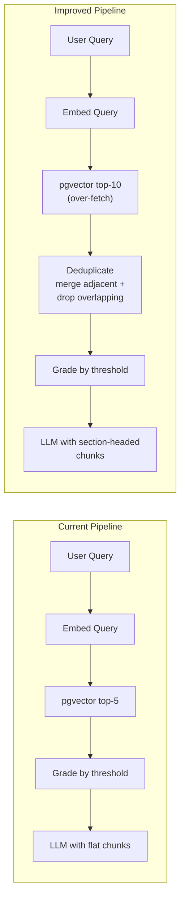

# RAG Retrieval Quality Improvements

## Problem

Retrieved chunks are fragmented, duplicated, and lack structural context. The root causes:

- **500-char chunks** split mid-section, losing coherence
- **Overlapping character splits** produce near-identical chunks that waste top-k slots
- **No structural awareness** -- chunker treats markdown as flat text, ignoring headers

## Ambiguities and Assumptions

- **Chunk size upper bound** -- `all-MiniLM-L6-v2` has a 256-token max input (~1200 chars). Sections longer than this must be sub-split. Assumption: set fallback chunk size to 1000 chars to stay within the model's effective range while maximizing context per chunk.
- **Dedup strategy: merge vs. drop** -- When adjacent chunks from the same document are retrieved, we could merge them into a single larger block or just drop the lower-scored duplicate. Assumption: merge adjacent chunks (richer context for the LLM), drop non-adjacent overlapping chunks (they're genuinely redundant).
- **Section heading depth** -- Markdown pages may have `#` through `######`. Assumption: split on `#`, `##`, `###` only. Deeper headings stay within their parent section chunk. This avoids creating tiny chunks from `####` subsections.
- **Non-markdown files** -- PDFs and TXT files have no header structure. Assumption: use the existing `RecursiveCharacterTextSplitter` path with the updated (larger) size defaults. No section metadata stored for these.
- **Backward compatibility** -- `section_heading` is nullable, so existing chunks (if any survive) won't break. But they should be re-processed. Assumption: re-seed after deploying.

## Retrieval Pipeline (before and after)




## High-Impact Changes (implementing all three)

### 1. Markdown-aware chunking with section metadata

**What:** For markdown files, split on section headers first (preserving each section as a coherent unit), then sub-split only sections that exceed the max chunk size. Store the section heading hierarchy as metadata on each chunk.

**Where:**

- [backend/app/services/processing.py](backend/app/services/processing.py) -- new `chunk_markdown()` function alongside existing `chunk_text()`
- [backend/app/db/models.py](backend/app/db/models.py) -- add nullable `section_heading` column to `Chunk`
- New alembic migration `0005_add_section_heading_to_chunks.py`

**How:** Use LangChain's `MarkdownHeaderTextSplitter` for the first pass (split on `#`, `##`, `###`), then `RecursiveCharacterTextSplitter` for sections exceeding max size. The `PipelineProcessor.process()` method checks `content_type` and dispatches to the appropriate chunking strategy. Each chunk stores the concatenated header path (e.g. `"Damage > Receiving damage > Modifying damage taken"`) in `section_heading`.

For non-markdown files (PDF, TXT), the existing `RecursiveCharacterTextSplitter` path is preserved with the larger chunk size.

**Dependencies:** `MarkdownHeaderTextSplitter` is available from the already-installed `langchain-text-splitters>=0.3` package. No new dependencies needed.

### 2. Increase chunk size defaults

**What:** Raise `DEFAULT_CHUNK_SIZE` from 500 to 1000, and `DEFAULT_CHUNK_OVERLAP` from 100 to 200.

**Where:** [backend/app/services/processing.py](backend/app/services/processing.py) lines 22-23.

**Why:** 500 chars is roughly 2-3 sentences. For explanatory wiki content, a full paragraph or subsection (800-1200 chars) is a much better unit of retrieval. The `all-MiniLM-L6-v2` model handles inputs up to 256 tokens (~1200 chars) well. This change applies to the fallback splitter used when markdown sections are too large, and to all non-markdown documents.

### 3. Post-retrieval deduplication

**What:** After vector search returns top-k results, remove near-duplicate chunks before passing to the LLM. Two mechanisms:

- **Adjacent-chunk merging:** If multiple chunks from the same document are consecutive by `chunk_index`, merge them into a single context block (preserving more continuous context). The merged chunk keeps the highest `similarity_score` of the group.
- **Content overlap filtering:** If two chunks share high token overlap (> 70% Jaccard on whitespace-split tokens), drop the lower-scoring one.

**Where:** [backend/app/services/retrieval.py](backend/app/services/retrieval.py) -- new `deduplicate_chunks()` function, called after the vector search in `RetrievalService.search()`. Increase the raw retrieval `top_k` (over-fetch) so that after dedup we still have enough chunks.

**Config:** Add `RETRIEVAL_CANDIDATE_K` (default 10) for the raw fetch, while `RETRIEVAL_TOP_K` (default 5) remains the final post-dedup target.

### 4. Improved context formatting with section headings

**What:** Use stored section headings in the context passed to the LLM, so it sees structural context.

**Where:** [backend/app/agent/graph.py](backend/app/agent/graph.py) `_build_generate_node` -- update the context formatting to include section headings when available.

**Before:**

```
[Source: Damage.md]
chunk content here
```

**After:**

```
[Source: Damage.md > Receiving damage > Modifying damage taken]
chunk content here
```

---

## Assessment of Remaining Improvements

### Parent-child retrieval -- **Skip**

Embeds small chunks for precise matching but returns the larger parent section when matched. This is powerful in theory, but section-aware chunking already solves the same problem (keeping coherent sections together). Adding parent-child requires a second tier of stored chunks, a parent-child relationship in the DB, and more complex retrieval logic. The marginal gain over section-aware chunking does not justify the complexity for this project.

### Cross-encoder reranking -- **Skip**

Over-fetch candidates then rerank with a cross-encoder model (e.g. `ms-marco-MiniLM-L-6-v2`). Cross-encoders are better at judging relevance than bi-encoder cosine similarity. However: (a) the root problem is bad chunking, not bad ranking -- fixing chunking eliminates most irrelevant/duplicate results; (b) it adds a second ML model dependency and increases query latency; (c) it adds complexity to the retrieval pipeline. Worth revisiting after chunking improvements are in place and evaluated, but premature now.

### Metadata filtering at query time -- **Partial**

Storing section headings is cheap and already part of improvement 1. Using them in context formatting (improvement 4) helps the LLM understand structure. However, *actively filtering* by section heading at query time (e.g. "only search chunks under the 'Damage' heading") requires either an LLM pre-processing step to extract expected section names or a second embedding comparison on headings alone. Both add latency and complexity for uncertain gain. **We take the free part (store + display) and skip the active filtering.**

---

## Implementation Steps

### Step 1: ADR + schema (write ADR before code)

Write [.docs/adr/0005-rag-retrieval-improvements.md](.docs/adr/0005-rag-retrieval-improvements.md) documenting the decisions and trade-offs above. Then add the `section_heading` column to the `Chunk` model and create the alembic migration.

**Commits:** ~1 (ADR + migration + model change)

### Step 2: Markdown-aware chunking + larger defaults

Implement `chunk_markdown()` in [backend/app/services/processing.py](backend/app/services/processing.py). Update `DEFAULT_CHUNK_SIZE` / `DEFAULT_CHUNK_OVERLAP`. Update `PipelineProcessor.process()` to dispatch based on `content_type`. Store `section_heading` on each chunk.

**Tests:**

- `chunk_markdown()` with a multi-section markdown document produces one chunk per section
- A section exceeding 1000 chars gets sub-split, each sub-chunk inherits the section heading
- `###` and deeper headings stay within parent section
- Empty markdown / markdown with no headers falls back to `chunk_text()`
- `chunk_text()` still works for non-markdown input with the new defaults (1000/200)
- Existing test `test_respects_size_limit` updated for new default

**Commits:** ~2 (chunking implementation, tests)

### Step 3: Post-retrieval deduplication

Implement `deduplicate_chunks()` in [backend/app/services/retrieval.py](backend/app/services/retrieval.py). Add `section_heading` to `RetrievedChunk`. Add `RETRIEVAL_CANDIDATE_K` to [backend/app/config.py](backend/app/config.py). Wire the over-fetch and dedup into `RetrievalService.search()`.

**Tests:**

- Adjacent chunks from the same document are merged in order, content concatenated
- Non-adjacent chunks from the same document with >70% token overlap: lower-scored one is dropped
- Chunks from different documents are never merged or dropped against each other
- When no duplicates exist, output equals input (no-op)
- Over-fetch returns more candidates than final `top_k`
- Merged chunk retains the highest similarity score of its constituents

**Commits:** ~2 (dedup implementation, tests)

### Step 4: Context formatting + final review

Update context formatting in [backend/app/agent/graph.py](backend/app/agent/graph.py). When `section_heading` is present, include it in the `[Source: ...]` line. When absent (non-markdown chunks), fall back to filename only.

Self-review all changes against [.cursor/rules/code-review.mdc](.cursor/rules/code-review.mdc). Run full test suite.

**Commits:** ~1 (formatting + polish)

---

## Files Changed

- [backend/app/services/processing.py](backend/app/services/processing.py) -- new `chunk_markdown()`, update defaults, dispatch by content type
- [backend/app/db/models.py](backend/app/db/models.py) -- add `section_heading` column to `Chunk`
- `backend/alembic/versions/0005_add_section_heading_to_chunks.py` -- new migration
- [backend/app/services/retrieval.py](backend/app/services/retrieval.py) -- add `deduplicate_chunks()`, update `RetrievedChunk`, over-fetch logic
- [backend/app/agent/graph.py](backend/app/agent/graph.py) -- update context formatting
- [backend/app/config.py](backend/app/config.py) -- add `RETRIEVAL_CANDIDATE_K` setting
- [backend/tests/test_processing.py](backend/tests/test_processing.py) -- tests for `chunk_markdown()`, updated defaults
- `backend/tests/test_retrieval.py` -- new tests for deduplication
- [.docs/adr/0005-rag-retrieval-improvements.md](.docs/adr/0005-rag-retrieval-improvements.md) -- ADR

## Post-change: re-seed required

Existing document chunks were created with the old strategy. After deploying these changes, existing documents must be re-processed. The simplest path: delete all documents via the API (or truncate the tables) and re-run `scripts/seed_wiki.py`.