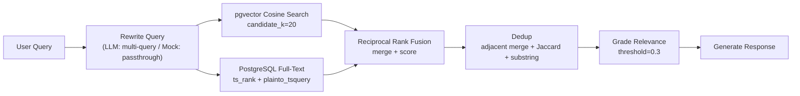
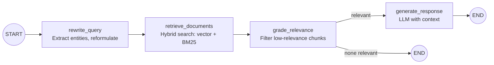

# RAG Retrieval Quality Improvements

## 1. Problem Summary

The query "what sort of skills does the witch use" returns 3/5 irrelevant chunks (Mercenary, Shadow, Witchhunter). The system fails to distinguish between the Witch class and unrelated entities that share partial vocabulary. This is a retrieval problem, not an LLM problem -- fixing it improves answer quality regardless of which LLM is used.

**Observed failure modes**:

- Cross-class contamination: chunks from Witchhunter, Mercenary, and Shadow appear in results for a Witch query
- Duplicate content: the "I do not fear death" flavor text appears twice, wasting a result slot
- Relevant content buried: the actual answer (occult spells, minions, chaos spells) is present in the corpus but doesn't dominate the top-k

## 2. Root Cause Analysis

| #   | Root Cause                                 | Evidence                                                                                                                                                             | Severity                                                           |
| --- | ------------------------------------------ | -------------------------------------------------------------------------------------------------------------------------------------------------------------------- | ------------------------------------------------------------------ |
| 1   | Pure vector search conflates related terms | `all-MiniLM-L6-v2` embeds "witch" and "witchhunter" close together due to lexical overlap. "Skills" appears in every class page, providing no discriminating signal. | High                                                               |
| 2   | Similarity threshold too low (0.1)         | Nearly everything passes the relevance gate. Low-quality matches fill result slots that should go to better candidates.                                              | Medium                                                             |
| 3   | Chunks embedded without document context   | A chunk from `Witch.md` and one from `Witchhunter.md` both embed raw content. The embedding has no signal about *which entity* the chunk describes.                  | High                                                               |
| 4   | No query understanding                     | Raw user question goes directly to vector search. No step to identify the key entity ("Witch") or reformulate for retrieval.                                         | Medium                                                             |
| 5   | Content gap in source material             | `Witch.md` is ~95% dialogue. Relevant content (occult spells, minions, chaos) is a few sentences split across `Witch.md` and `Character class.md`.                   | Low (out of scope -- this is a data problem, not a system problem) |

## 3. Ambiguities and Assumptions

| Area                          | Ambiguity                                                                 | Assumption                                                                                                                                                                       |
| ----------------------------- | ------------------------------------------------------------------------- | -------------------------------------------------------------------------------------------------------------------------------------------------------------------------------- |
| Hybrid search scoring         | How to weight vector vs. BM25 results?                                    | Use Reciprocal Rank Fusion (RRF) with k=60. This is a well-studied default that avoids tuning per-query weights.                                                                 |
| tsvector language config      | Which PostgreSQL text search config to use?                               | `'english'` -- the wiki content is English prose.                                                                                                                                |
| Chunk enrichment prefix       | How much context to prepend?                                              | Document title (filename minus extension) + section heading, separated by `>`. Keep it short so it doesn't dominate the embedding.                                               |
| Query rewriting with mock LLM | Mock LLM can't meaningfully rewrite queries.                              | Node is a passthrough when `LLM_PROVIDER=mock`. The graph still traverses the node (testable), but the query is unchanged. With Ollama, the LLM generates 2-3 search variations. |
| Similarity threshold value    | 0.3 is a heuristic -- may over-filter or under-filter.                    | Start at 0.3 based on observed score distributions. The threshold remains configurable via `SIMILARITY_THRESHOLD` env var.                                                       |
| Dedup aggressiveness          | Lowering Jaccard from 0.70 to 0.60 may drop legitimately distinct chunks. | Accept the tradeoff. Result diversity is more valuable than marginal extra coverage when top-k is only 5.                                                                        |

## 4. Architecture Changes

### Current Retrieval Flow

### Proposed Retrieval Flow

### Updated LangGraph Agent

### Key Files Modified

- `**backend/app/services/retrieval.py**` -- Hybrid search, RRF scoring, improved dedup
- `**backend/app/services/processing.py**` -- Chunk context enrichment at embedding time
- `**backend/app/agent/graph.py**` -- New `rewrite_query` node
- `**backend/app/config.py**` -- New settings (`RETRIEVAL_MODE`), updated defaults
- `**backend/app/db/models.py**` -- `search_vector` column on `Chunk`
- `**backend/alembic/versions/**` -- New migration for tsvector + GIN index

### Data Model Change

**chunks table** -- add one column:

- `search_vector` (`tsvector`, nullable) -- populated via `to_tsvector('english', content)` during ingestion, indexed with GIN

## 5. ADRs to Write

- **ADR 0006**: Retrieval quality improvements -- hybrid search, chunk context enrichment, query rewriting. Written before Milestone 3 (hybrid search is the significant architectural decision).

## 6. What This Does NOT Include (and why)

- **Cross-encoder reranking**: Small model (~22MB), low integration cost. Addresses ranking quality after retrieval. Could be a fast follow-up if hybrid search alone doesn't sufficiently clean up borderline results. Excluded for now because the dominant failure mode is retrieval (wrong docs fetched), not ranking (right docs in wrong order).
- **LLM-based relevance grading**: Requires real LLM calls per chunk. Not viable with mock LLM. Cosine threshold + hybrid search is sufficient.
- **Parent-child retrieval**: Adds significant DB complexity (two tiers of chunks, parent-child FK). Chunk context enrichment achieves a similar effect more simply.

## 7. Milestones

### Milestone 1: Config Tuning + Dedup Fix

**Goal**: Quick wins that improve results immediately with minimal code changes.

**Implementation**:

- In [backend/app/config.py](backend/app/config.py): raise `SIMILARITY_THRESHOLD` default from `0.1` to `0.3`, raise `RETRIEVAL_CANDIDATE_K` from `10` to `20`
- In [backend/app/services/retrieval.py](backend/app/services/retrieval.py):
  - Add substring containment check to `_drop_overlapping`: if chunk A's content is a substring of chunk B's content, drop the shorter one (keep the chunk with more context)
  - Lower `_OVERLAP_THRESHOLD` from `0.70` to `0.60`

**Tests**:

- Unit test: substring containment dedup correctly drops the shorter chunk
- Unit test: Jaccard dedup at 0.60 threshold drops chunks that 0.70 would have kept
- Existing dedup tests still pass (verify no regressions)

**Commits**: ~2 (config defaults, dedup improvements)

---

### Milestone 2: Chunk Context Enrichment

**Goal**: Embeddings capture document identity, not just content. A chunk from `Witch.md` should embed differently than a chunk from `Witchhunter.md` even if the raw content is similar.

**Implementation**:

- In [backend/app/services/processing.py](backend/app/services/processing.py), in `PipelineProcessor.process()`:
  - Accept `filename` parameter (or derive document title from it by stripping extension)
  - When building the texts list for `embed_texts()`, prepend `"{title} > {section_heading}: "` (or just `"{title}: "` when no heading)
  - Store the **original content** unchanged in `Chunk.content` -- the prefix is only in the embedding input
- Update callers (`document_service.py`) to pass the filename through

**Tests**:

- Unit test: `chunk_markdown` output is unchanged (enrichment happens in the processor, not the chunker)
- Unit test: verify the embedding input includes the title prefix but the stored content does not
- Integration test: process a test document and verify chunk content vs. embedding input differ by the prefix

**Commits**: ~2 (enrichment logic, caller updates)

---

### Milestone 3: Hybrid Search

**Goal**: Vector similarity combined with keyword-level precision via PostgreSQL full-text search. This is the highest-impact change and the most significant architectural decision.

**Write ADR 0006** before starting.

**Implementation**:

- New Alembic migration: add `search_vector tsvector` column (nullable) and GIN index to `chunks` table
- In [backend/app/db/models.py](backend/app/db/models.py): add `search_vector` column to `Chunk`
- In [backend/app/services/processing.py](backend/app/services/processing.py): populate `search_vector` via `func.to_tsvector('english', content)` during ingestion
- In [backend/app/config.py](backend/app/config.py): add `retrieval_mode` setting (`"hybrid"` | `"vector"` | `"keyword"`, default `"hybrid"`)
- In [backend/app/services/retrieval.py](backend/app/services/retrieval.py):
  - New `_bm25_search()` method: `plainto_tsquery` + `ts_rank`, returns ranked candidates
  - New `_rrf_merge()` function: takes two ranked lists, combines with `1/(k + rank)` per list, returns merged ranking
  - Update `search()` to dispatch based on `retrieval_mode`: vector-only, keyword-only, or hybrid (both + RRF)
  - Hybrid mode over-fetches `candidate_k` from each source, merges via RRF, then applies existing dedup

**Tests**:

- Unit test: RRF merge correctly combines two ranked lists (known inputs/outputs)
- Unit test: BM25 search returns results ranked by text relevance
- Unit test: hybrid mode returns results that differ from vector-only mode
- Integration test: "witch skills" query returns Witch chunks higher than Witchhunter chunks in hybrid mode
- Verify `retrieval_mode="vector"` produces identical behavior to the pre-change system

**Commits**: ~4 (migration + model, BM25 search method, RRF merge, retrieval mode dispatch)

---

### Milestone 4: Query Rewriting Node

**Goal**: Demonstrate LangGraph extensibility by adding a pre-retrieval node that reformulates the query for better search.

**Implementation**:

- In [backend/app/agent/graph.py](backend/app/agent/graph.py):
  - New `rewrite_query` node inserted before `retrieve_documents`
  - State gains `search_queries: list[str]` field (defaults to `[query]`)
  - With Ollama LLM: prompt asks for 2-3 search-optimized reformulations of the user question
  - With mock LLM: passthrough -- `search_queries = [query]`
- In `retrieve_documents` node: run search for each query in `search_queries`, merge all candidates, then dedup
- Graph edges: `START → rewrite_query → retrieve_documents → grade_relevance → ...`

**Tests**:

- Unit test: mock LLM passthrough returns original query unchanged
- Unit test: multi-query retrieval with 2 queries produces merged results
- Unit test: graph structure has 4 nodes in expected order
- Existing agent tests still pass

**Commits**: ~2 (rewrite node + state change, multi-query retrieval integration)

---

### Milestone 5: Re-seed, Verify, Document

**Goal**: Apply all changes to real data and verify the "witch skills" query produces better results.

**Implementation**:

- Truncate existing documents and chunks (or drop and re-migrate)
- Re-run `scripts/seed_wiki.py` -- this re-processes all 153 wiki pages with context-enriched embeddings and populated tsvector columns
- Manually test the "witch skills" query and compare results to the screenshots
- Update README "Future Improvements" section with: cross-encoder reranking, LLM-based grading, parent-child retrieval

**Verification criteria**:

- "What sort of skills does the witch use" returns chunks primarily from `Witch.md` and `Character class.md > Witch` section
- No Mercenary, Shadow, or Witchhunter chunks in top-5
- No duplicate content in top-5
- Results include mention of occult spells, minions, chaos spells

**Commits**: ~2 (re-seed script adjustments if needed, README updates)

## 8. Dependency Summary

**No new Python dependencies required.** All functionality uses existing libraries:

- `sqlalchemy` -- already used; provides `func.to_tsvector`, `func.plainto_tsquery`, `func.ts_rank`
- `langchain-text-splitters` -- already used; no changes
- `langgraph` -- already used; new node follows existing patterns
- PostgreSQL -- already used; tsvector and GIN index are built-in features

