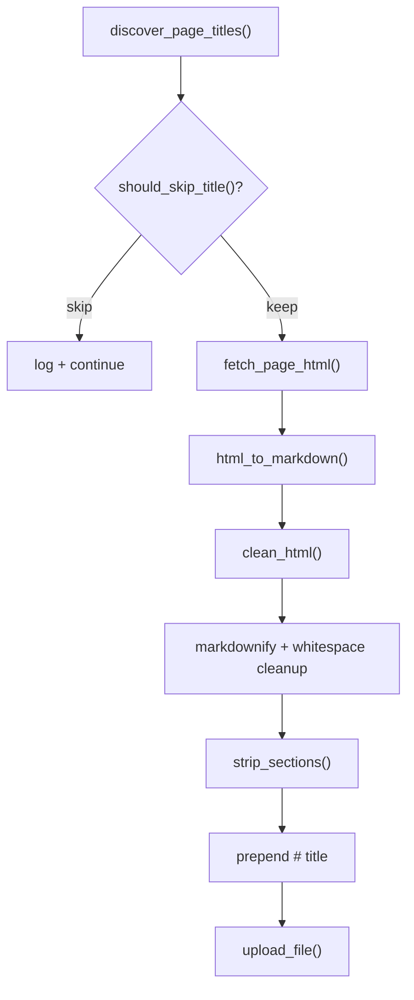

# Strip Noisy Wiki Sections

## 1. Requirements Summary

Source: content quality analysis of 153 cached wiki pages in `wiki_pages/`.

- Strip 6 categories of `##`-level sections from wiki markdown before upload: **Version history**, **References**, **See also**, **Dialogues**, **Gallery**, **Gameplay video**
- Exclude entire pages whose title starts with "Version" (patch indexes and individual patch-notes pages like `Version 0.4.0f`)
- Stripping must happen in [scripts/seed_wiki.py](scripts/seed_wiki.py), not in the backend processing pipeline, because this is wiki-specific noise -- general user uploads should not have sections silently removed
- Inline noise (stub notices, `[[1]]` markers, redlink text) is out of scope for now
- After code changes, re-seed the database so existing noisy chunks are replaced

## 2. Ambiguities and Assumptions

| Area             | Ambiguity                                                         | Assumption                                                                                                                                                                           |
| ---------------- | ----------------------------------------------------------------- | ------------------------------------------------------------------------------------------------------------------------------------------------------------------------------------ |
| Heading level    | Should we strip matching `###` headings too, or only `##`?        | Only match at `##` level. A matched `##` section implicitly removes its child `###`/`####` content since stripping runs to the next `##` or EOF.                                     |
| Page exclusion   | "Version" prefix also matches "Versioning" or other titles        | The wiki has no such pages; only `Version history` and `Version X.Y.Zn` exist. A prefix check on "Version" is safe. `Vendor` does not match because it doesn't start with "Version". |
| Case sensitivity | Wiki headings may vary in casing                                  | Match case-insensitively. The heading list stores lowercase; comparison lowercases the markdown heading.                                                                             |
| Re-seed strategy | Can we re-upload over existing documents or must we delete first? | Delete cached `.md` files so the seeder re-fetches and re-converts. For the DB, delete existing wiki documents via the API before re-uploading.                                      |
| Dialogues scope  | Dialogues have gameplay-adjacent lore                             | Per user decision, strip Dialogues. They are ~130 lines of flavor text per class page with no mechanics value.                                                                       |

## 3. High-Level Architecture

The change is scoped entirely to the seeder script. No backend or frontend changes.

**Key modules:**

- `scripts/seed_wiki.py` -- wiki fetching, HTML-to-markdown conversion, upload orchestration. All changes land here.
- `scripts/tests/test_seed_wiki.py` -- new test file for `strip_sections()` and `should_skip_title()`

**Data flow for `strip_sections()`:**

1. `re.split(r'^(?=## )', md, flags=re.MULTILINE)` splits markdown into fragments at each `##`  boundary
2. Each fragment's first-line heading text is extracted and lowercased
3. Fragments whose heading matches any entry in `_STRIP_SECTION_HEADINGS` are filtered out
4. Remaining fragments are rejoined

No data model changes. The `Chunk` table schema is unchanged.

## 4. ADRs to Write

None. This is a targeted data-quality fix in the seeder script, not a structural or architectural decision. The rationale (strip at ingestion time, not retrieval time) is documented in this plan.

## 5. Milestones

### Milestone 1: Implement stripping logic and tests

**Goal:** `seed_wiki.py` strips noisy sections and skips Version pages, verified by unit tests.

**Implementation details:**

- Add `_SKIP_TITLE_PREFIXES = ["Version"]` and `should_skip_title(title: str) -> bool` to `seed_wiki.py`
- Add `_STRIP_SECTION_HEADINGS` list with 6 entries (version history, references, see also, dialogues, gallery, gameplay video)
- Add `strip_sections(md: str, headings: Sequence[str]) -> str` using `re.split` single-pass approach
- Call `should_skip_title()` in `run()` loop (~line 201) to skip before fetch
- Call `strip_sections()` in `html_to_markdown()` after whitespace cleanup, before title prepend
- Create `scripts/tests/test_seed_wiki.py` with tests

**Tests:**

- `strip_sections`: section at end of document (no following `##`)
- `strip_sections`: section in the middle (between two `##` sections)
- `strip_sections`: no matching section (passthrough)
- `strip_sections`: case-insensitive matching (`## VERSION HISTORY`)
- `strip_sections`: multiple matching sections in one document
- `strip_sections`: section with `###` sub-headings removed together
- `strip_sections`: empty input returns empty
- `should_skip_title`: `"Version history"` -> True
- `should_skip_title`: `"Version 0.4.0f"` -> True
- `should_skip_title`: `"Armour"` -> False
- `should_skip_title`: `"Vendor"` -> False (does not start with "Version")

**Commits:** 1 commit -- `feat(seed): strip noisy sections and skip version pages during wiki seeding`

---

### Milestone 2: Re-seed the database

**Goal:** The database contains only clean, stripped wiki chunks with no version history or other noisy sections.

**Implementation details:**

- Delete cached `.md` files in `wiki_pages/` so the seeder re-fetches and re-converts with stripping
- Delete existing wiki documents from the DB (via API or direct cleanup)
- Re-run `python scripts/seed_wiki.py --output-dir ./wiki_pages`
- Spot-check a few pages (e.g. Armour, Flask, Sorceress) in the cached output to verify noisy sections are gone

**Tests:** Manual verification -- grep cached `.md` files for `## Version history`, `## References`, `## Dialogues` to confirm they are absent.

**Commits:** 0 commits (operational step, no code change)

## 6. Dependency Summary

No new dependencies. All implementation uses the standard library (`re`) and existing dependencies (`BeautifulSoup`, `markdownify`, `httpx`) already in `scripts/seed_wiki.py`.