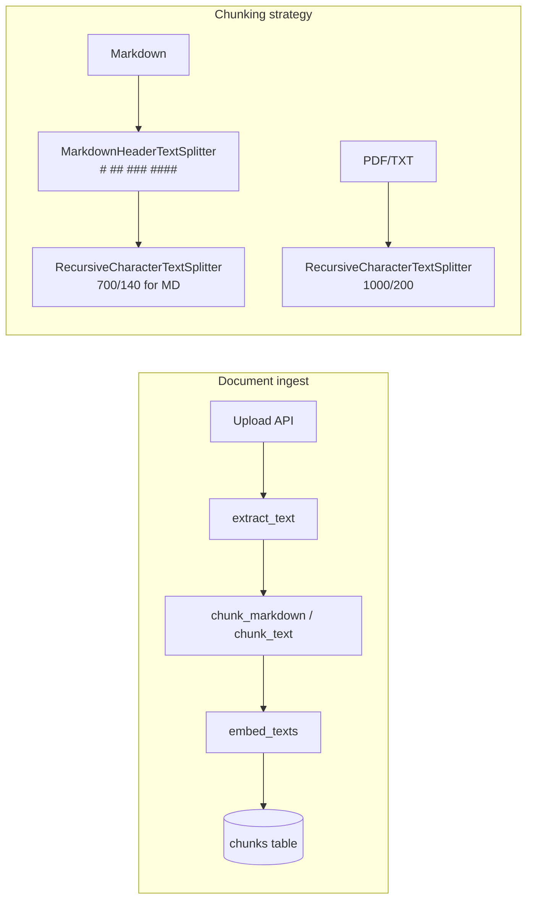

## 1. Requirements Summary

- Chunk wiki-style content along **structural boundaries** so vectors are less noisy; avoid mixing unrelated blocks (lists, historical vs current, sub-topics) in a single chunk.
- Preserve existing behavior for non-markdown (PDF/TXT): continue using `RecursiveCharacterTextSplitter` with current defaults.
- Use **header hierarchy** and **chunk size** (and optionally horizontal rules) so that:
  - More sections are bounded by headings (e.g. `####`), reducing size-driven sub-splits.
  - When sub-splitting is needed, smaller markdown chunks reduce mixed-context within one embedding.
- No new runtime dependencies; stay within current stack (LangChain text splitters, existing `chunk_markdown` / `chunk_text` pipeline).
- Document the decision in an ADR; keep `section_heading` backward-compatible (e.g. deeper paths like `"Top > Middle > Deep > Deeper"`).

Source: User requirement (wiki context shifts, vector noise); existing design in [backend/app/services/processing.py](backend/app/services/processing.py) and [.docs/adr/0005-rag-retrieval-improvements.md](.docs/adr/0005-rag-retrieval-improvements.md).

---

## 2. Ambiguities and Assumptions

| Area                | Ambiguity                                                          | Assumption                                                                                                                                                          |
| ------------------- | ------------------------------------------------------------------ | ------------------------------------------------------------------------------------------------------------------------------------------------------------------- |
| Heading depth       | How many heading levels to add (#### only vs #### and #####).      | Add `####` (h4) only; `_build_heading_path` and metadata keys extended for h4. Deeper levels can be added later if needed.                                          |
| Markdown chunk size | Exact values for “smaller” markdown chunks.                        | Use `MARKDOWN_CHUNK_SIZE = 700` and `MARKDOWN_CHUNK_OVERLAP = 140` for `chunk_markdown` only; keep `DEFAULT_CHUNK_SIZE`/`DEFAULT_CHUNK_OVERLAP` for plain text/PDF. |
| Horizontal rules    | Whether to treat `---` / `***` / `___` as hard section boundaries. | Implement as optional Milestone 2; split on standalone HR lines so major wiki blocks become separate chunks. Bold-line boundaries deferred.                         |
| Re-processing       | Whether to re-seed or re-run pipeline after chunking changes.      | Assumed: existing documents are re-processed (re-upload or re-run seed) to re-chunk and re-embed; no automatic backfill in this plan.                               |

---

## 3. High-Level Architecture

**Key modules**

- [backend/app/services/processing.py](backend/app/services/processing.py) — `chunk_markdown`, `chunk_text`, `_MARKDOWN_HEADERS`, `_build_heading_path`, `PipelineProcessor.process`; constants for chunk sizes.
- [backend/tests/test_processing.py](backend/tests/test_processing.py) — Tests for chunking (headers, sizes, HR if added).
- [.docs/adr/](.docs/adr/) — New ADR for wiki-aware chunking.

**Data model**

- **chunks** (existing): `id`, `document_id`, `chunk_index`, `content`, `section_heading` (nullable), `embedding`, `search_vector`, `created_at`. No schema change; `section_heading` may contain deeper paths (e.g. with h4).
- **documents**: unchanged; `chunk_count` updated when documents are re-processed.

---

## 4. ADRs to Write

1. **Wiki-aware chunking** — Rationale for structural boundaries (extended headers, smaller markdown chunk size, optional HR splitting); alternatives (list-aware separators, bold-line boundaries) and why deferred.

---

## 5. Milestones

### Milestone 1: Extend header hierarchy and markdown chunk size

**Goal:** Markdown is split on `#`–`####`, and oversized sections are sub-split with 700/140 limits so chunks align better with wiki structure and carry less mixed-context noise.

**Implementation details**

- In [backend/app/services/processing.py](backend/app/services/processing.py):
  - Add `("####", "h4")` to `_MARKDOWN_HEADERS`.
  - Extend `_build_heading_path` to include `h4` in the path (e.g. `"H1 > H2 > H3 > H4"`).
  - Introduce `MARKDOWN_CHUNK_SIZE` (700) and `MARKDOWN_CHUNK_OVERLAP` (140); use them only inside `chunk_markdown` (and in any callers that need markdown-specific size). Keep `DEFAULT_CHUNK_SIZE` / `DEFAULT_CHUNK_OVERLAP` for `chunk_text` and non-markdown.
- Ensure `PipelineProcessor.process` continues to call `chunk_markdown(text)` without passing size (so `chunk_markdown` uses its own defaults).
- Add ADR in [.docs/adr/](.docs/adr/) for wiki-aware chunking (problem, options, chosen strategy).

**Tests**

- Markdown with `####`: sections under `####` become separate chunks; heading path includes h4.
- Oversized section: sub-chunks respect 700-char limit (and overlap 140) when using `chunk_markdown`.
- Plain text/PDF path unchanged: still uses 1000/200 via `chunk_text`.
- Empty / whitespace-only markdown still returns empty list.

**Commits**

- One: extend headers + markdown chunk size constants + ADR (and update README index if ADR table exists).

---

### Milestone 2: Horizontal-rule split boundaries (optional)

**Goal:** Standalone horizontal rules (`---`, `***`, `___`) act as split points so major wiki blocks separated by HRs become distinct chunks (or distinct sections before size-based sub-split).

**Implementation details**

- In [backend/app/services/processing.py](backend/app/services/processing.py): before or after the header split, split on lines that are only `---`, `***`, or `___` (with optional surrounding whitespace). Options: (a) pre-pass that splits the markdown string and feeds each block into the existing header splitter, or (b) add a separator that matches HR lines to a custom splitter used only for the “section” pass. Prefer the approach that avoids duplicating header logic (e.g. split on HR first, then run header split on each HR-separated block).
- Preserve `section_heading` for chunks from HR-separated blocks (inherit from the last header above that block).
- Update ADR to document HR as an additional boundary.

**Tests**

- Markdown with `---` between blocks: chunks do not mix content from opposite sides of the HR.
- Markdown with headers and HR: heading path still correct for chunks below the HR.
- Edge cases: HR at start/end of document; multiple consecutive HRs.

**Commits**

- One: HR splitting logic + tests + ADR update.

---

## 6. Dependency Summary

**Backend**

- **langchain-text-splitters** (existing) — `MarkdownHeaderTextSplitter`, `RecursiveCharacterTextSplitter`; no new packages. Optional: use regex or string split for HR detection (stdlib only).

