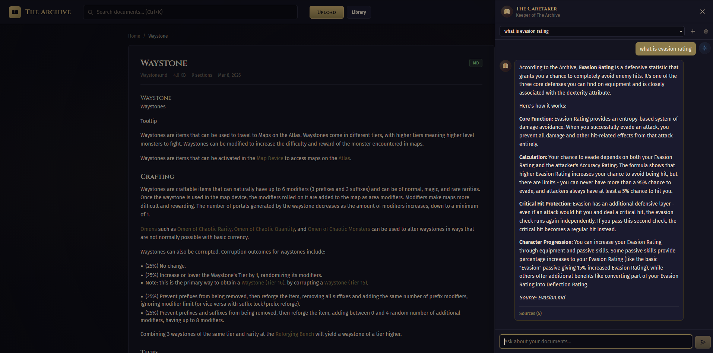
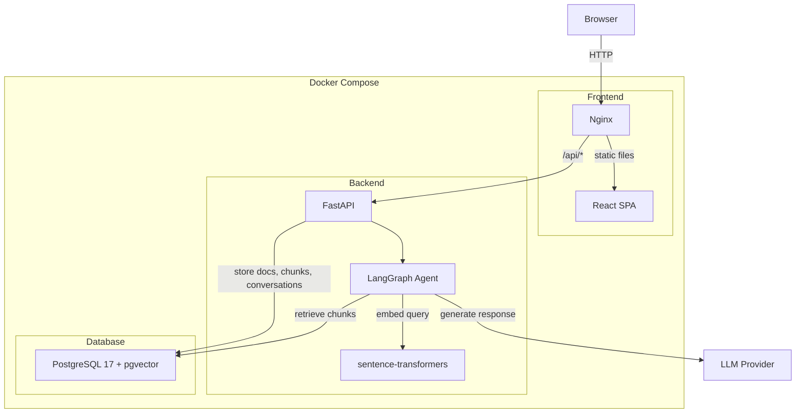

# The Archive

*A devoted scholar guards a vast collection of knowledge. Ask, and The Caretaker shall guide you through the texts.*




---

## Quick Start

```bash
cp .env.example .env
docker compose up --build
```

> **First build takes ~10 minutes** -- PyTorch and sentence-transformers are downloaded as transitive dependencies. Subsequent starts use cached layers and are fast.

Once the services are up, open [http://localhost:5173](http://localhost:5173).

### Seed with documents

A bundle of Path of Exile 2 wiki pages ships with the repo for immediate use:

```bash
cd scripts
pip install -r requirements.txt
python seed_documents.py --zip wiki_pages.zip
```

You can also upload your own PDF, TXT, or Markdown files through the UI or API.

---

## What It Does

The Archive is a NotebookLM-style app where you upload documents and chat with an AI agent that answers from their content.

- **Document management** -- Upload PDF, TXT, and Markdown files. View, search, and delete from a library page.
- **RAG chat** -- Ask questions and get answers grounded in your documents, with source attribution linking back to the originals.
- **Hybrid search** -- Combined vector similarity and BM25 keyword search with Reciprocal Rank Fusion for retrieval quality.
- **Streaming responses** -- Real-time token streaming with Server-Sent Events.
- **The Caretaker** -- A themed AI persona that speaks with quiet authority, citing documents by name and matching response depth to question specificity.

---

## Architecture



### Data flows

**Upload**: File received -> text extracted (pypdf / plain read) -> split into chunks (Markdown-aware, wiki-optimized) -> embedded with all-MiniLM-L6-v2 -> stored in PostgreSQL with pgvector

**Chat**: User message -> query rewriting -> hybrid retrieval (vector + BM25 + RRF) -> relevance grading -> LLM generation with source attribution -> streamed back via SSE

---

## LLM Providers

The Archive supports three LLM backends, configured via the `LLM_PROVIDER` environment variable:

| Provider | `LLM_PROVIDER` | Requirements | Notes |
|----------|-----------------|--------------|-------|
| Mock | `mock` | None | Default. Returns canned responses. Good for testing the full pipeline without tokens. |
| Ollama | `ollama` | [Ollama](https://ollama.ai/) running locally | Set `OLLAMA_MODEL` and `OLLAMA_BASE_URL`. Supports streaming. |
| Anthropic | `anthropic` | API key | Set `ANTHROPIC_API_KEY`. Uses Claude with real token streaming. |

See [`.env.example`](.env.example) for all available configuration.

---

## Design Decisions

Key architectural choices are recorded as ADRs in [`.docs/adr/`](.docs/adr/):

| Decision | Summary |
|----------|---------|
| [ADR-0001](.docs/adr/0001-use-python-fastapi-react.md) | Python + FastAPI + React + LangGraph -- Python-first because the LangChain ecosystem is Python-native |
| [ADR-0002](.docs/adr/0002-data-storage-strategy.md) | PostgreSQL with pgvector for metadata and embeddings in one store; filesystem for raw uploads |
| [ADR-0004](.docs/adr/0004-langgraph-agent-architecture.md) | LangGraph StateGraph with retrieve/grade/generate nodes and pluggable LLM providers |
| [ADR-0006](.docs/adr/0006-hybrid-search-and-retrieval-quality.md) | Hybrid search (vector + BM25 with Reciprocal Rank Fusion) for retrieval quality |
| [ADR-0008](.docs/adr/0008-poe2-design-system-approach.md) | PoE2-inspired design system via Tailwind v4 `@theme` tokens |
| [ADR-0011](.docs/adr/0011-wiki-aware-chunking.md) | Wiki-aware Markdown chunking with header hierarchy and horizontal rule splitting |

---

## Process Audit Trail

The `.cursor/plans/` directory contains structured implementation plans.

---

## Links

- [Backend README](backend/README.md) -- service-level docs, API reference, environment variables
- [Frontend README](frontend/README.md) -- service-level docs, scripts, design system
- [ADR Index](.docs/adr/README.md) -- all architectural decisions
- [OpenAPI Docs](http://localhost:8000/docs) -- interactive API explorer (when backend is running)
